## Ajax

### 什么是`Ajax`
`Ajax` 的全称是 `Asynchronous JavaScript And XML`（异步 `JavaScript` 和 `xml`）

通俗理解：在网页中利用 `XMLHttpRequest` 对象和服务器进行数据交互的方式，无需刷新整个页面动态得获取服务器端数据，就是`Ajax`

### `jQuery`中的Ajax

#### `jQuery`中的Ajax的概念
浏览器中提供的 `XMLHttpRequest` 用法比较复杂，所以 `jQuery` 对 `XMLHttpRequest` 进行了封装，提供了一系列Ajax相关的函数，极大地 **降低了Ajax的使用难度**

jQuery`中发起 Ajax 请求最常用的三个方法如下：

- `$.get()` get方式请求，用于获取数据
- `$.post()` post方式请求，用于提交数据
- `$.ajax()` 比较综合，既可以获取数据，又可以提交数据


#### `jQuery`中的Ajax的语法
 **1. `$.get()` 函数**
`jQuery` 中 `$.get()` 函数的功能单一，专门用来发起 `get` 请求，从而将服务器上的资源请求到客户端来进行使用（可以返回消息告知浏览器get请求成功！）

```javascript
$.get(url,[data],[callback])
```

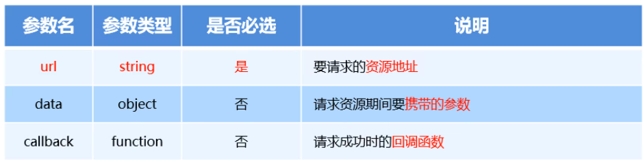

**2. $.get()发起不带参数的请求**


使用 $.get() 函数 发起不带参数的请求时，直接提供给 **请求的 URL 地址** 和 **请求成功之后的回调函数** 即可，示例代码如下

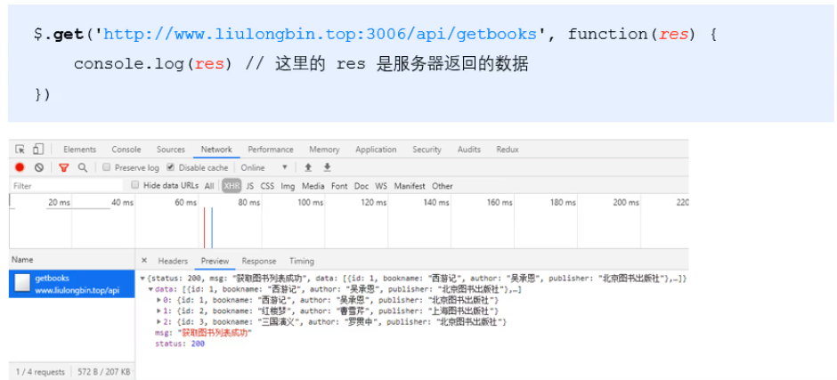

**3. $.get()发起携带参数的请求**

使用`$.get()` 发起携带参数的请求，那么携带的参数应该写在第二个参数的位置，示例代码如下：

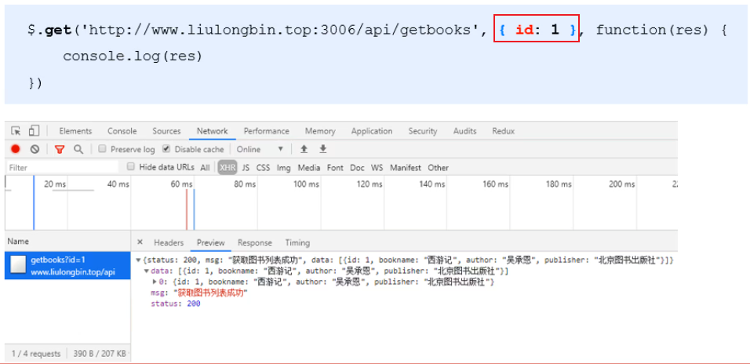

**4. $.post() 函数介绍**

`jQuery` 中 `$.post()` 函数的功能单一，专门用来发起`post`请求，从而向服务器提交数据

`$.post()` 函数的语法如下：

```javascript
$.post(url,[data],[callback])
```

参数各自代表的含义如下：

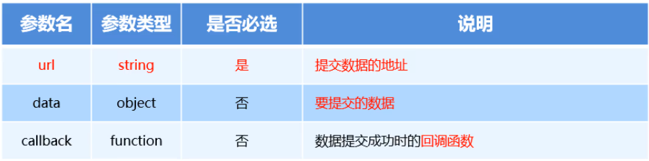

**5. $.post() 向服务器提交数据**

使用 `$.post()` 向服务器提交数据的示例代码如下：

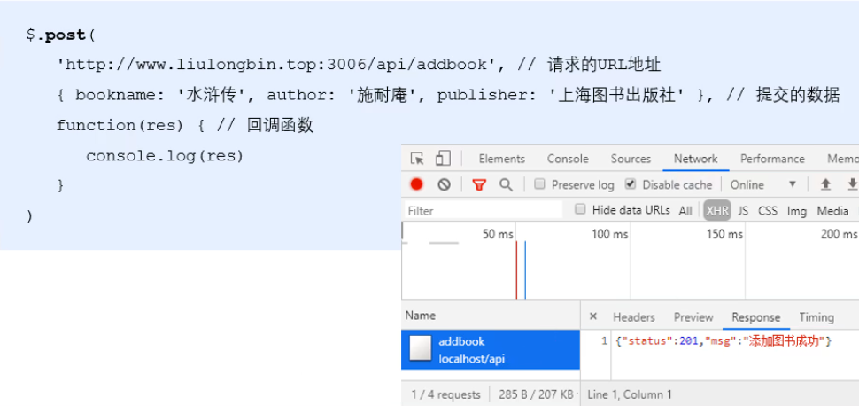

**6. `$.ajax()` 函数介绍**

相比于 `$.get()` 和 `$.post()` 函数，`jQuery` 中提供的 `$.ajax()` 函数，是一个功能比较综合的函数，它允许我们对 `Ajax` 请求进行更详细的配置。

`$.ajax()` 函数的基本语法如下：


**7. `$.ajax()` 发起 get 请求**

使用 `$.ajax()` 发起 `GET` 请求时，只需要将 `type` 属性 的值设置为 ‘`GET`’ 即可：

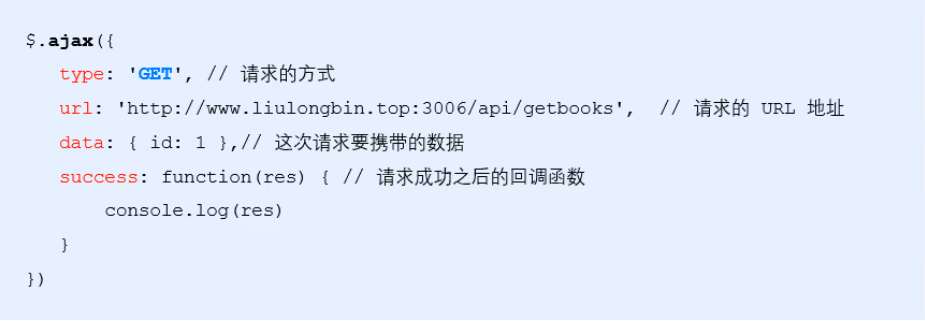

**8. `$.ajax` 发起 post 请求**

使用 `$.ajax()` 发起 `post`请求，只需要把 `type`属性的值 设置为 ‘`post`’ 即可

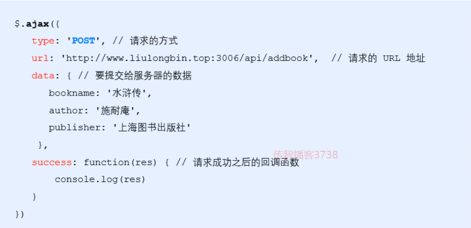


### 接口

使用 `Ajax` 请求数据时，被请求的 `URL` 地址，就叫做 数据接口（简称**接口**）。同时，每个接口必须有请求方式。

#### 接口测试工具

为了验证接口是否被正常被访问，我们常常需要使用接口测试工具，来对数据接口进行检测

**好处：**接口测试工具能让我们在 **不写任何代码** 的情况下，对接口进行 **调用** 和 **测试**

常用的就是：[PostMan](https://www.getpostman.com/downloads/)

#### 接口文档

接口文档，顾名思义就是 **接口的说明文档**，**它是我们调用接口的依据**。好的接口文档包含了对 **接口URL**，**参数** 以及 **输出内容** 的说明，我们参照接口文档就能方便的知道接口的作用，以及接口如何进行调用

### Form表单的基本使用

#### 什么是表单

表单在网页中主要负责 **数据采集功能**。HTML中`<form>`标签，就是用于采集用户输入的信息，并通过 `<form> `标签的提交操作，把采集的信息提交到服务器端进行处理

    表单的组成部分：

    - 表单标签
    - 表单域：包含了文本框，密码框，隐藏域，都行文本框，复选框，单选框，下拉选择框和文件上传框等等
    - 表单按钮：通过设置`type`属性为`submit`来触发`form`表单的提交


#### `<form>` 标签的属性

**1.  `action`**

`action` 属性用来规定当提交表单时，**向何处发送表单数据**。

`action` 属性的值应该是后端提供的一个URL地址，这个URL地址专门负责接收表单提交过来的数据。

当 `<form>`表单在未制定 `action` 属性值的清空下，`action`的默认值为当前页面的 `URL` 地址

**注意:** 当提交表单后，会立即跳转到 `action` 属性指定的 `URL` 地址

**2. `target`**

`target` 属性用来规定 在何处打开 `action URL`

它的可选值有5个，默认情况下，target的值是 _self，表示在相同的框架中打开 action URL

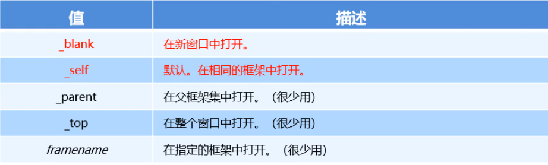

**3. `method`**

`method` 属性用来规定 **以何种方式** 把表单数据提交到 action URL

它的可选值有两个，分别是 `get` 和 `post`

默认情况下，`method`的值为 `get`， 表示通过`URL`地址的形式，把表单数据提交到 `action URL`

**注意：**

- get 方式适合用来提交**少量的**，**简单的**数据
- post 方式适合用来提交**大量的**，**复杂的**，**保密的**，或包含**文件上传**的数据

**3. `enctype`**

`enctype`属性用来规定在 **发送表单数据之前如何对数据进行编码**

它的可选值有三个，默认情况下，`enctype`的值为 `application/x-www-form-urlencoded`，表示在发送前编码的所有字符

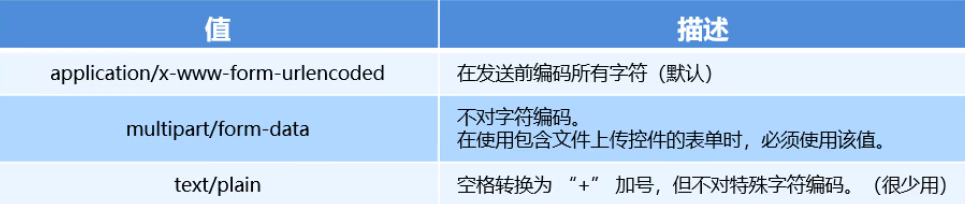
#### 表单的同步提交
**什么是表单的同步提交**

通过点击 submit 按钮，触发表单提交的操作，从而使页面跳转到 `action URL` 的行为，叫做表单的同步提交

**表单同步提交的缺点**

- `<form>` 表单同步提交后，整个页面会发生跳转，**跳转到 action URL 所指向的地址**，用户体验很差
- `<form>` 表单同步提交后，页面之前的状态和数据会丢失

**如何解决呢？**

**表单只复杂采集数据，Ajax负责将数据提交到服务器**


### 通过Ajax提交表单数据

- 监听表单提交事件

```
$('#form1').submit(function(e) {
alert('监听到了表单的提交事件')
})
$('#form1').on('submit',function(e) {
alert('监听到了表单的提交事件')
})
```
- 阻止表单默认提交行为

    当监听到表单的提交事件以后，可以调用事件对象的 `event.preventDefault()` 函数，来阻止表单的提交和页面的跳转
    > e.preventDefault()


#### 如何快速获取表单数据

**`serialize()` 函数**

```
//HTML代码
<form id="form1 ">
<input type="text" name= "username" />
<input type="password" name="password" />
<button type= " submit">提交</button>
</form>

//js代码
$('#form1').serialize ()
//调用的结果:
// username 用户名的值spassword=密码的值

```

**注意**：在使用 serialize() 函数快速获取表单数据时，**必须为每个表单元素添加 name 属性**


#### 了解`xhr`对象的`readyState`属性

`XMLHttpRequest` 对象的 `readyState` 属性，用来表示**当前 `Ajax` 请求所处的状态**。每个 `Ajax` 请求必然处于以下状态中的一个：

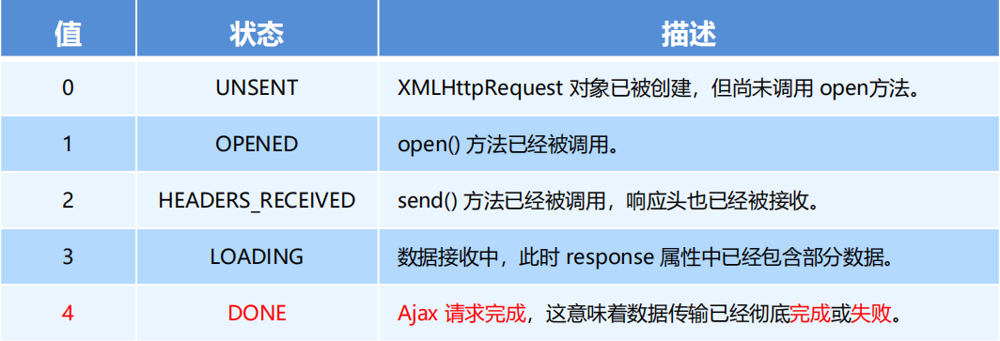


#### 使用`xhr`发起带参数的GET请求

使用 `xhr` 对象发起带参数的 `GET` 请求时，只需在调用 `xhr.open` 期间，为 `URL` 地址指定参数即可：


这种在 URL 地址后面拼接的参数，叫做**查询字符串**。

```javascript
var xhr = new XMLHttpRequest()
xhr.open('GET', 'http://www.liulongbin.top:3006/api/getbooks?id=1')
xhr.send()
xhr.onreadystatechange = function () {
  if (xhr.readyState === 4 && xhr.status === 200) {
     console.log(xhr.responseText)
  }
}
```

#### 使用`xhr`发起`POST`请求（⭐⭐⭐）

**步骤**

- 创建 `xhr` 对象

- 调用 `xhr.open()` 函数

- **设置 Content-Type 属性**（固定写法）

- 调用 `xhr.send()` 函数，**同时指定要发送的数据**

- 监听 `xhr.onreadystatechange` 事件

```javascript
// 1. 创建 xhr 对象
var xhr = new XMLHttpRequest()
// 2. 调用 open 函数
xhr.open('POST', 'http://www.liulongbin.top:3006/api/addbook')
// 3. 设置 Content-Type 属性（固定写法）
xhr.setRequestHeader('Content-Type', 'application/x-www-form-urlencoded')
// 4. 调用 send 函数
xhr.send('bookname=水浒传&author=施耐庵&publisher=上海图书出版社')
// 5. 监听事件
xhr.onreadystatechange = function () {
  if (xhr.readyState === 4 && xhr.status === 200) {
    console.log(xhr.responseText)
  }
}
```


#### 查询字符串

 **1. 什么是查询字符串**

**定义：**查询字符串（URL 参数）是指在 URL 的末尾加上用于向服务器发送信息的字符串（变量）。

**格式：**将英文的 **?** 放在`URL` 的末尾，然后再加上 **参数＝值** ，想加上多个参数的话，使用 **&** 符号进行分隔。以

这个形式，可以将想要发送给服务器的数据添加到 `URL` 中。

```
//不带参数的URL地址
http://www.liulongbin.top:3006/api/getbooks
//带一个参数的URL地址
http://www.liulongbin.top:3006/api/getbooks?id=1
//带两个参数的URL地址
http://www.liulongbin.top:3006/api/getbooks?id=1&bookname=西游记

```

**2. GET请求携带参数的本质**

无论使用 `$.ajax()`，还是使用 `$.get()`，又或者直接使用 `xhr` 对象发起 `GET` 请求，当需要携带参数的时候，本质上，都是直接将参数以查询字符串的形式，追加到 URL 地址的后面，发送到服务器的。

```
$.get('url',{name: 'zs',age: 20}，function() {})
//等价于
$.get('url?name=zs&age=20', function() {})
$.ajax({ method:'GET', url:'url', data:{name:'zs' ，age:20}, success:function() {} }}
//等价于
$.ajax({ method:'GET',url:'url?name zs&age=20'success:function() {} })
```

### URL编码与解码

#### 什么是URL编码

`URL` 地址中，只允许出现英文相关的字母、标点符号、数字，因此，在 `URL` 地址中不允许出现中文字符。

如果 URL 中需要包含中文这样的字符，则必须对中文字符进行**编码**（转义）。

**URL编码的原则**：使用安全的字符（没有特殊用途或者特殊意义的可打印字符）去表示那些不安全的字符。

URL编码原则的通俗理解：使用英文字符去表示非英文字符

```
http://www.liulongbin.top:3006/api/getbooks?id=1&bookname=西游记
//经过URL编码之后，URL地址变成了如下格式:
http://www .1iulongbin . top: 3006/api/getbooks?id=1&bookname= %E8%A5%BF%E6%B8%B8%E8%AE%B0

//三个%E8这样的字符代表一个汉字

```

#### 如何对URL进行编码与解码

浏览器提供了 `URL` 编码与解码的 `API`，分别是：

-  `encodeURI()` 编码的函数

-  `decodeURI()` 解码的函数

```
encodeURI ('黑马程序员)
//输出字符串
%E9%BB%91%E9%A9%AC%E7%A8%8B%E5%BA%8F%E5%91%98
decodeURI ( '%E9%BB%91%E9%A9%AC' )
//输出字符串
黑马
```

**由于浏览器会自动对 URL 地址进行编码操作，因此，大多数情况下，程序员不需要关心 URL 地址的编码** **与解码操作**

## 模板引擎的实现原理(⭐⭐)

正则与字符串操作

### exec函数

`exec()` 函数用于 **检索字符串** 中的正在表达式的匹配

如果字符串中又匹配的值，**则返回该匹配值**，否则返回 **null**

```
RegExpobject.exec (string)
```

示例代码如下：

```
var str = 'hello'
var pattern = /0/
//输出的结果["o", index:4, input:"hello", groups:undefined]
console.log(pattern.exec(str))
```

### 分组

正则表达式中 （） 包起来的内容表示一个分组，可以通过分组来 **提取自己想要的内容**，示例代码如下

```
var str ='<div>我是{{name}}</div>'
var pattern = /{{ ([a-zA-Z]+)}}/
var patternResult = pattern.exec(str)
console.log(patternResult)
// 得到name 相关的分组信息
// ["{{name}}", "name", index: 7, input: "<div>我是{{name}}</div>", groups: undefined]
```

### 字符串的 replace 函数

replace() 函数用于在字符串中 用一些字符 替换 另一些字符的

```
var result = '123456' . replace('123','abc')
 //得到的result的值为字符串'abc456'
```

示例代码：

```
var str = '<div>我是{{name}}</div>'
var pattern = /{{([a-zA-Z]+)}}/

var patternResult =pattern. exec (str) 
str = str.replace(patternResult[0], patternResult[1]) // replace 函数返回值为替换后的新宇符串
//输出的内容是: <div>我是name</div>
console.log(str)
```

#### 多次replace

```
var str = '<div>{{name}}今年{{ age }}岁了</div>'
var pattern = /{{\s*([a-zA-Z]+)\s*}}/

var patternResult = pattern.exea (str)
str = str.replace(patternResult[0], patternResult[1])
console.log(str) //输出<div>name今年{{ age }}岁了</div>

patternResult = pattern.exec(str)
str = str.replace (patternResult[0], patternResult[1])
console.log(str) //输出<div>name今年age岁了</div>

patternResult = pattern.exec(str)
console.log(patternResult) // 输出null
```

#### 使用循环来replace

因为用户输入的字符串长度不确定，我们replace次数不确定，所以我们可以利用while循环来进行

```
var str = '<div>{{name}} 今年{{ age }}岁了</div>'
var pattern = /{{\s*([a-zA-Z]+)\s*}/

var patternResult = null
while (patternResult = pattern.exec(str) ) {
str = str.replace(patternResult[0], patternResult[1] )
}

console.log(str) //输出<div>name今年age岁 了</div>
```

### 实现简易的模板引擎

- 定义模板结构

```
<!-- 定义模板结构-->
<script type="text/html" id="tpl-user">
<div>姓名: {{name}}</div>
<div>年龄: {{ age }}</div>
<div>性别: {{ gender}}</div>
<div>住址: {{address } }</div>
</script>
```

- 预调用模板引擎
```
<script>
//定义数据
var data = { name: 'zs'， age: 28，gender: '男'， address: 北京顺义马坡' }
//调用模板函数
var htmlStr = template('tpl-user', data)
//渲染HTML结构
document.getElementById('user -box').innerHTML = htmlStr
</script>
```

- 封装 template 函数

```
function template(id, data) {
var str = document: getElementById(id).innerHTML

var pattern = /{{\s*([a-zA-Z]+) \s*}}/
var pattResult = nul1
while((pattResult = pattern.exec(str))) {
str = str.replace(pattResult[0], data[pattResult[1]])
return str
}
```

- 导入并使用自定义的模板引擎


### `XMLHttpRequest`的基本使用


#### 使用`xhr`发起GET请求

**步骤**

- 创建 `xhr` 对象

- 调用 `xhr.open()` 函数

- 调用 `xhr.send()` 函数

- 监听 `xhr.onreadystatechange` 事件

```javascript
// 1. 创建 XHR 对象
var xhr = new XMLHttpRequest()
// 2. 调用 open 函数
xhr.open('GET', 'http://www.liulongbin.top:3006/api/getbooks')
// 3. 调用 send 函数
xhr.send()
// 4. 监听 onreadystatechange 事件
xhr.onreadystatechange = function () {
  if (xhr.readyState === 4 && xhr.status === 200) {
     // 获取服务器响应的数据
     console.log(xhr.responseText)
   }
}
```

## 数据交换格式

### 什么是数据交换格式

数据交换格式，就是**服务器端**与**客户端**之间进行**数据传输与交换的格式**

前端领域，经常提及的两种数据交换格式分别是 `XML` 和 `JSON`。其中 `XML` 用的非常少，所以，我们重点要学

习的数据交换格式就是 `JSON`


### XML

#### 什么是XML

`XML` 的英文全称是 `EXtensible Markup Language`，即**可扩展标记语言**。因此，`XML` 和 `HTML` 类似，也是一种标记语言。

```
<note>
<to>ls</to>
<from>zs</from>
<heading>通知</heading>
<body>晚上开会</body>
</note>

```

#### XML和HTML的区别

`XML` 和 `HTML` 虽然都是标记语言，但是，它们两者之间没有任何的关系。

- `HTML` 被设计用来描述网页上的**内容**，是网页内容的载体

- `XML` 被设计用来**传输和存储数据**，是数据的载体


#### XML的缺点


-  `XML` 格式臃肿，和数据无关的代码多，体积大，传输效率低

-  在 `Javascript` 中解析 `XML` 比较麻烦

### `JSON（⭐⭐⭐）`

#### 什么是`JSON`

**概念：**`JSON` 的英文全称是 `JavaScript Object Notation`(符号)，即“**JavaScript 对象表示法**”。简单来讲，`JSON` 就是 `Javascript` 对象和数组的字符串表示法，它使用文本表示一个 `JS` 对象或数组的信息，因此，**`JSON` 的本质是字符串**。

**作用：**`JSON` 是一种轻量级的文本数据交换格式，在作用上类似于 `XML`，专门用于存储和传输数据，但是 `JSON` 比 `XML` 更小、更快、更易解析。

**现状：**`JSON` 是在 2001 年开始被推广和使用的数据格式，到现今为止，`JSON` 已经成为了主流的数据交换格式

#### `JSON`的两种结构

`JSON` 就是用字符串来表示 `Javascript` 的对象和数组。所以，`JSON` 中包含**对象**和**数组**两种结构，通过这两种结构的相互嵌套，可以表示各种复杂的数据结构。

##### **对象结构**

对象结构在 `JSON` 中表示为 `{ }` 括起来的内容。数据结构为 `{ key: value, key: value, … }` 的键值对结构。其中，`key` 必须是使用英文的双引号包裹的字符串，`value` 的数据类型可以是**数字、字符串、** **布尔值、null、数组、对象**6种类型。


##### **数组结构**

数组结构在 `JSON` 中表示为 `[ ]` 括起来的内容。数据结构为 `[ "java", "javascript", 30, true … ]` 。

数组中数据的类型可以是**数字、字符串、布尔值、null、数组、对象**6种类型。


####  `JSON`语法注意事项

① 属性名必须使用双引号包裹

② 字符串类型的值必须使用双引号包裹

③ `JSON` 中不允许使用单引号表示字符串

④ `JSON` 中不能写注释

⑤ `JSON` 的最外层必须是对象或数组格式

⑥ 不能使用 `undefined` 或函数作为 `JSON` 的值

>`JSON`的作用:在计算机与网络之间存储和传输数据。
>`JSON` 的本质:用字符串来表示 `Javascript` 对象数据或数组数据

#### `JSON`和`JS`对象的关系

`JSON` 是 `JS` 对象的字符串表示法，它使用文本表示一个 `JS` 对象的信息，本质是一个字符串。例如：

```
//这是一个对象
var obj = {a:'Hello', b:'World'}
//这是一个JSON字符串，本质是一个字符串
var json = '{"a":"Hello","b":"World"} '

```

#### `JSON`和`JS`对象的互转

要实现从 `JSON` 字符串转换为 `JS` 对象，使用 `JSON.parse()` 方法：

```
var obj = JSON.parse(' {"a":"Hello", "b":"World"} ')
/ /结果是{a: 'Hello', b: 'World' }
```

要实现从 `JS` 对象转换为 `JSON` 字符串，使用 `JSON.stringify()` 方法：

```
var json = JSON.stringify({a: 'Hel1o', b: 'World' })
//结果是'{"a": "Hello", "b": "World"} '
```

**应用场景**

当后端服务器传来的数据为JSON格式，我们就可以使用JSON.parse将JSON数据转成对象或数据形式。反之，传数据也可以。


#### 序列化和反序列化

把**数据对象** **转换为** **字符串**的过程，叫做**序列化**，例如：调用 `JSON.stringify()` 函数的操作，叫做 `JSON` 序列化。

把**字符串** **转换为** **数据对象**的过程，叫做**反序列化**，例如：调用 `JSON.parse()` 函数的操作，叫做 `JSON` 反序列化。


## `XMLHttpRequest Level2`的新特性

### 旧版`XMLHttpRequest`的缺点

- 只支持文本数据的传输，无法用来读取和上传文件

- 传送和接收数据时，没有进度信息，只能提示有没有完成

###  `XMLHttpRequest Level2`的新功能

- 可以设置 HTTP 请求的时限

- 可以使用 `FormData` 对象管理表单数据

- 可以上传文件

- 可以获得数据传输的进度信息

### 设置`HTTP`请求时限

有时，`Ajax` 操作很耗时，而且无法预知要花多少时间。如果网速很慢，用户可能要等很久。新版本的 `XMLHttpRequest` 对象，增加了 `timeout` 属性，可以设置 `HTTP` 请求的时限：

>xhr.timeout = 3000


上面的语句，将最长等待时间设为 3000 毫秒。过了这个时限，就自动停止HTTP请求。与之配套的还有一个`timeout` 事件，用来指定回调函数：

>xhr.ontimeout = function (event) {alert ('请求超时! ') }


```javascript
<script>
  var xhr = new XMLHttpRequest()
  // 设置 超时时间
  xhr.timeout = 30
  // 设置超时以后的处理函数
  xhr.ontimeout = function () {
    console.log('请求超时了！')
  }
  xhr.open('GET', 'http://www.liulongbin.top:3006/api/getbooks')
  xhr.send()
  xhr.onreadystatechange = function () {
    if (xhr.readyState === 4 && xhr.status === 200) {
      console.log(xhr.responseText)
    }
  }
</script>
```

### `FormData`对象管理表单数据

Ajax 操作往往用来提交表单数据。为了方便表单处理，`HTML5` 新增了一个`FormData` 对象，可以模拟表单操作：

```javascript
 // 1. 新建 FormData 对象
 var fd = new FormData()
 // 2. 为 FormData 添加表单项
 fd.append('uname', 'zs')
 fd.append('upwd', '123456')
 // 3. 创建 XHR 对象
 var xhr = new XMLHttpRequest()
 // 4. 指定请求类型与URL地址
 xhr.open('POST', 'http://www.liulongbin.top:3006/api/formdata')
 // 5. 直接提交 FormData 对象，这与提交网页表单的效果，完全一样
 xhr.send(fd)
```

`FormData`对象也可以用来获取网页表单的值，示例代码如下：

```javascript
// 获取表单元素
var form = document.querySelector('#form1')
// 监听表单元素的 submit 事件
form.addEventListener('submit', function(e) {
 e.preventDefault()
 // 根据 form 表单创建 FormData 对象，会自动将表单数据填充到 FormData 对象中
 var fd = new FormData(form)
 var xhr = new XMLHttpRequest()
 xhr.open('POST', 'http://www.liulongbin.top:3006/api/formdata')
 xhr.send(fd)
 xhr.onreadystatechange = function() {}
})
```

### 上传文件

新版 `XMLHttpRequest` 对象，不仅可以发送文本信息,还可以上传文件。

**实现步骤：**

① 定义 `UI` 结构

② 验证是否选择了文件

③ 向 `FormData` 中追加文件

④ 使用 `xhr` 发起上传文件的请求

⑤ 监听 `onreadystatechange` 事件

#### 定义`UI`结构

```html
 <!-- 1. 文件选择框 -->
 <input type="file" id="file1" />
 <!-- 2. 上传按钮 -->
 <button id="btnUpload">上传文件</button>
 <br />
 <!-- 3. 显示上传到服务器上的图片 -->
 
```

#### 验证是否选择了文件

```javascript
// 1. 获取上传文件的按钮
var btnUpload = document.querySelector('#btnUpload')
// 2. 为按钮添加 click 事件监听
btnUpload.addEventListener('click', function() {
 // 3. 获取到选择的文件列表
 var files = document.querySelector('#file1').files
 if (files.length <= 0) {
 return alert('请选择要上传的文件！')
 }
 // ...后续业务逻辑
})
```

#### 向`FormData`中追加文件

```javascript
// 1. 创建 FormData 对象
var fd = new FormData()
// 2. 向 FormData 中追加文件
fd.append('avatar', files[0])
```

#### 使用 `xhr` 发起上传文件的请求

```javascript
// 1. 创建 xhr 对象
var xhr = new XMLHttpRequest()
// 2. 调用 open 函数，指定请求类型与URL地址。其中，请求类型必须为 POST
xhr.open('POST', 'http://www.liulongbin.top:3006/api/upload/avatar')
// 3. 发起请求
xhr.send(fd)
```

####  监听`onreadystatechange`事件

```javascript
xhr.onreadystatechange = function() {
 if (xhr.readyState === 4 && xhr.status === 200) {
 	 var data = JSON.parse(xhr.responseText)
     if (data.status === 200) { // 上传文件成功
     // 将服务器返回的图片地址，设置为  标签的 src 属性
        document.querySelector('#img').src = 'http://www.liulongbin.top:3006' + data.url
     } else { // 上传文件失败
         console.log(data.message)
     }
 }
}
```

### 显示文件上传进度

#### 计算文件上传进度

新版本的 `XMLHttpRequest` 对象中，可以通过监听 `xhr.upload.onprogress` 事件，来获取到文件的上传进度。语法格式如下：

```javascript
// 创建 XHR 对象
var xhr = new XMLHttpRequest()
// 监听 xhr.upload 的 onprogress 事件
xhr.upload.onprogress = function(e) {
     // e.lengthComputable 是一个布尔值，表示当前上传的资源是否具有可计算的长度
     if (e.lengthComputable) {
         // e.loaded 已传输的字节
         // e.total 需传输的总字节
         var percentComplete = Math.ceil((e.loaded/e.total)*100)
     }
 }
```

#### 导入需要的库

```html
<link rel="stylesheet" href="./lib/bootstrap.css" />
<script src="./lib/jquery.js"></script>
```

#### 基于`Bootstrap`渲染进度条

```html
 <!-- 进度条 -->
 <div class="progress" style="width: 500px; margin: 10px 0;">
     <div class="progress-bar progress-bar-info progress-barstriped active" id="percent" style="width: 0%">
     0%
     </div>
 </div>
```

#### 动态设置到进度条上

```javascript
xhr.upload.onprogress = function(e) {
     if (e.lengthComputable) {
         // 1. 计算出当前上传进度的百分比
         var percentComplete = Math.ceil((e.loaded / e.total)*100)
         $('#percent')
         // 2. 设置进度条的宽度
         .attr('style', 'width:' + percentComplete + '%')
         // 3. 显示当前的上传进度百分比
         .html(percentComplete + '%')
     }
}
```

#### 监听上传完成的事件

```javascript
xhr.upload.onload = function() {
     $('#percent')
     // 移除上传中的类样式
     .removeClass()
     // 添加上传完成的类样式
     .addClass('progress-bar progress-bar-success')
}
```


## `axios（⭐⭐⭐）`

### 什么是`axios`

`Axios` 是专注于**网络数据请求**的库。

相比于原生的 `XMLHttpRequest` 对象，`axios` **简单易用**。

相比于 `jQuery`，`axios` 更加**轻量化**，只专注于网络数据请求。

### `axios`发起GET请求

`axios` 发起 `get` 请求的语法：

```javascript
axios.get('url', { params: { /*参数*/ } }).then(callback)
```

**具体的请求示例如下：**

```javascript
// 请求的 URL 地址
var url = 'http://www.liulongbin.top:3006/api/get'
// 请求的参数对象
var paramsObj = { name: 'zs', age: 20 }
// 调用 axios.get() 发起 GET 请求
axios.get(url, { params: paramsObj }).then(function(res) {
     // res.data 是服务器返回的数据
     var result = res.data
     console.log(res)
})
```

### `axios`发起`POST`请求

`axios` 发起 `post` 请求的语法：

```javascript
axios.post('url', { /*参数*/ }).then(callback)
```

**具体的请求示例如下：**

```javascript
// 请求的 URL 地址
var url = 'http://www.liulongbin.top:3006/api/post'
// 要提交到服务器的数据
var dataObj = { location: '北京', address: '顺义' }
// 调用 axios.post() 发起 POST 请求
axios.post(url, dataObj).then(function(res) {
     // res.data 是服务器返回的数据
     var result = res.data
     console.log(result)
})
```

### 直接使用`axios`发起请求

`axios` 也提供了类似于 `jQuery` 中 `$.ajax()` 的函数，语法如下：

```javascript
axios({
 method: '请求类型',
 url: '请求的URL地址',
 data: { /* POST数据 */ },
 params: { /* GET参数 */ }
}).then(callback)
```

**发起get请求**

```javascript
document.querySelector('#btn3').addEventListener('click', function () {
      var url = 'http://www.liulongbin.top:3006/api/get'
      var paramsData = { name: '钢铁侠', age: 35 }
      axios({
        method: 'GET',
        url: url,
        params: paramsData
      }).then(function (res) {
        console.log(res.data)
      })
})
```

**发起post请求**

```javascript
document.querySelector('#btn4').addEventListener('click', function () {
  axios({
    method: 'POST',
    url: 'http://www.liulongbin.top:3006/api/post',
    data: {
      name: '娃哈哈',
      age: 18,
      gender: '女'
    }
  }).then(function (res) {
    console.log(res.data)
  })
})
```


## 同源策略(⭐⭐⭐)

### 什么是同源

如果两个页面的协议，域名和端口都相同，则两个页面具有**相同的源**。
(端口不写，默认是80)

### 什么是同源策略

**同源策略**（英文全称 Same origin policy）是**浏览器**提供的一个**安全功能**

**`MDN` 官方给定的概念**：同源策略限制了从同一个源加载的文档或脚本如何与来自另一个源的资源进行交互。这是一个用于隔离潜在恶意文件的重要安全机制

通俗的理解：浏览器规定，A 网站的 JavaScript，不允许和非同源的网站 C 之间，进行资源的交互，例如：

① 无法读取非同源网页的 Cookie、LocalStorage 和 IndexedDB

② 无法接触非同源网页的 DOM

③ 无法向非同源地址发送 Ajax 请求


### 什么是跨域

**同源**指的是两个 URL 的协议、域名、端口一致，反之，则是**跨域**

出现跨域的根本原因：**浏览器的同源策略**不允许非同源的 URL 之间进行资源的交互

网页：`http://www.test.com/index.html`

接口：`http://www.api.com/userlist`

## 浏览器对跨域请求的拦截


**注意：**浏览器允许发起跨域请求，但是，跨域请求回来的数据，会被 **浏览器** 拦截，无法被页面获取到！

## 如何实现跨域数据请求

现如今，实现跨域数据请求，最主要的两种解决方案，分别是 `JSONP` 和 `CORS`。

**`JSONP`：**出现的早，兼容性好（兼容低版本IE）。是前端程序员为了解决跨域问题，被迫想出来的一种临时解决方案。**缺点**是只支持 `GET` 请求，不支持 `POST` 请求。

**`CORS`：**出现的较晚，它是 `W3C` 标准，属于跨域 `Ajax` 请求的根本解决方案。支持 `GET` 和 `POST` 请求。**缺点**是不兼容某些低版本的浏览器

## `JSONP`

### 什么是`JSONP`(⭐⭐⭐)

`JSONP` (`JSON with Padding`) 是 `JSON` 的一种“使用模式”，可用于解决主流浏览器的跨域数据访问的问题。（）

### `JSONP`的实现原理(⭐⭐⭐)

由于浏览器同源策略的限制，网页中无法通过 Ajax 请求非同源的接口数据。但是 `<script>` 标签不受浏览器同源策略的影响，可以通过 `src` 属性，请求非同源的 `js` 脚本。

因此，`JSONP` 的实现原理，就是通过 `<script>` 标签的 `src` 属性，请求跨域的数据接口，并通过**函数调用**的形式，接收跨域接口响应回来的数据

### 自己实现一个简单的`JSONP`

定义一个`success`回调函数：

```html
 <script>
     function success(data) {
     console.log('获取到了data数据：')
     console.log(data)
     }
 </script>
```

通过 `<script>` 标签，请求接口数据：

```html
<script src="http://ajax.frontend.itheima.net:3006/api/jsonp?callback=success&name=zs&a
ge=20"></script>
```

### `JSONP`的缺点

由于 `JSONP` 是通过 `<script>` 标签的 `src` 属性，来实现跨域数据获取的，所以，`JSONP` 只支持 `GET` 数据请求，不支持 POST 请求。

**注意：** **`JSONP` 和 Ajax 之间没有任何关系**，不能把 `JSONP` 请求数据的方式叫做 Ajax，因为 `JSONP` 没有用到`XMLHttpRequest` 这个对象

### `jQuery`中的`JSONP`

`jQuery` 提供的 `$.ajax()` 函数，除了可以发起真正的 `Ajax` 数据请求之外，还能够发起 `JSONP` 数据请求，例如：

```javascript
$.ajax({
     url: 'http://ajax.frontend.itheima.net:3006/api/jsonp?name=zs&age=20',
     // 如果要使用 $.ajax() 发起 JSONP 请求，必须指定 datatype 为 jsonp
     dataType: 'jsonp',
     success: function(res) {
     console.log(res)
     }
})
```

默认情况下，使用 `jQuery` 发起 `JSONP` 请求，会自动携带一个 `callback=jQueryxxx` 的参数，`jQueryxxx` 是随机生成的一个回调函数名称

#### 自定义参数及回调函数名称

在使用 `jQuery` 发起 `JSONP` 请求时，如果想要自定义 `JSONP` 的**参数**以及**回调函数名称**，可以通过如下两个参数来指定：

```javascript
$.ajax({
     url: 'http://ajax.frontend.itheima.net:3006/api/jsonp?name=zs&age=20',
     dataType: 'jsonp',
     // 发送到服务端的参数名称，默认值为 callback
     jsonp: 'callback',
     // 自定义的回调函数名称，默认值为 jQueryxxx 格式
     jsonpCallback: 'abc',
     success: function(res) {
     console.log(res)
     }
})
```

####  `jQuery`中`JSONP`的实现过程

`jQuery` 中的 `JSONP`，也是通过 `<script>` 标签的 `src` 属性实现跨域数据访问的，只不过，`jQuery` 采用的是**动态创建和移除标签**的方式，来发起 `JSONP` 数据请求。

- 在发起 `JSONP` 请求的时候，动态向 `<header>` 中 append 一个 `<script>` 标签；

- 在 `JSONP` 请求成功以后，动态从 `<header>` 中移除刚才 `append` 进去的 `<script>` 标签；


## 防抖&节流

### 什么是防抖(⭐⭐⭐)

**防抖策略**（`debounce`）是当事件被触发后，延迟 `n` 秒后再执行回调，如果在这 `n` 秒内事件又被触发，则重新计时。


**好处：**能够保证用户在频繁触发某些事件的时候，不会频繁的执行回调，只会被执行一次

### 防抖的应用场景

用户在输入框中连续输入一串字符时，可以通过防抖策略，只在输入完后，才执行查询的请求，这样可以有效减少请求次数，节约请求资源；

### 实现输入框的防抖

- 防抖动的 timer
- 定义防抖的函数，函数里面定义一个延时器，在演示器里面调用发起`JSONP`的请求
- 在触发 `keyup` 事件时，立即清空 `timer`，然后调用防抖的函数

```javascript
var timer = null // 1. 防抖动的 timer
function debounceSearch(keywords) { // 2. 定义防抖的函数
     timer = setTimeout(function() {
     // 发起 JSONP 请求
     getSuggestList(keywords)
     }, 500)
 }
$('#ipt').on('keyup', function() { // 3. 在触发 keyup 事件时，立即清空 timer
 clearTimeout(timer)
 // ...省略其他代码
 debounceSearch(keywords)
 })
```

### 缓存搜索的建议列表

#### 定义全局缓存对象

```javascript
 // 缓存对象
 var cacheObj = {}
```

#### 将搜索结果保存到缓存对象中

- 键就是用户输入的关键字，值就是服务器返回的value

```javascript
// 渲染建议列表
function renderSuggestList(res) {
     // ...省略其他代码
     // 将搜索的结果，添加到缓存对象中
     var k = $('#ipt').val().trim()
     cacheObj[k] = res
}
```

#### 优先从缓存中获取搜索建议

- 在发起请求之前，先判断缓存中是否有数据

```javascript
// 监听文本框的 keyup 事件
$('#ipt').on('keyup', function() {
     // ...省略其他代码
     // 优先从缓存中获取搜索建议
     if (cacheObj[keywords]) {
     return renderSuggestList(cacheObj[keywords])
     }
     // 获取搜索建议列表
     debounceSearch(keywords)
 })
```

## 节流

### 什么是节流(⭐⭐⭐)

**节流策略**（`throttle`），顾名思义，可以减少一段时间内事件的触发频率。


### 节流的应用场景

① 鼠标连续不断地触发某事件（如点击），只在单位时间内只触发一次；

② 懒加载时要监听计算滚动条的位置，但不必每次滑动都触发，可以降低计算的频率，而不必去浪费 CPU 资源；


#### 节流阀的概念

高铁卫生间是否被占用，由红绿灯控制，红灯表示被占用，绿灯表示可使用。

假设每个人上卫生间都需要花费5分钟，则五分钟之内，被占用的卫生间无法被其他人使用。

上一个人使用完毕后，需要将红灯**重置**为绿灯，表示下一个人可以使用卫生间。

下一个人在上卫生间之前，需要**先判断控制灯**是否为绿色，来知晓能否上卫生间。

节流阀为空，表示可以执行下次操作；不为空，表示不能执行下次操作。

当前操作执行完，必须将节流阀**重置**为空，表示可以执行下次操作了。

每次执行操作前，必须**先判断节流阀是否为空**。

#### 使用节流优化鼠标跟随效果

- 预定义一个 timer **节流阀**
- 当设置了鼠标跟随效果后，**清空** **timer** **节流阀**，方便下次开启延时器
- 执行事件的时候判断**节流阀**是否为空，如果不为空，则证明距离上次执行间隔不足16毫秒

```javascript
$(function() {
     var angel = $('#angel')
     var timer = null // 1.预定义一个 timer 节流阀
     $(document).on('mousemove', function(e) {
     if (timer) { return } // 3.判断节流阀是否为空，如果不为空，则证明距离上次执行间隔不足16毫秒
     timer = setTimeout(function() {
     $(angel).css('left', e.pageX + 'px').css('top', e.pageY + 'px')
     timer = null // 2.当设置了鼠标跟随效果后，清空 timer 节流阀，方便下次开启延时器
     }, 16)
     })
})
```

## 总结防抖和节流的区别

- **防抖**：如果事件被频繁触发，防抖能保证只有最有一次触发生效！前面 N 多次的触发都会被忽略！

- **节流**：如果事件被频繁触发，节流能够减少事件触发的频率，因此，节流是有选择性地执行一部分事件！

## HTTP协议简介

### 什么是通信

通信，就是**信息的传递和交换**。

通信三要素：

- 通信的主体

- 通信的内容

- 通信的方式

### **互联网中的通信**

**案例**服务器把传智专修学院的简介通过响应的方式发送给客户端浏览器。

其中，

通信的**主体**是服务器和客户端浏览器；

通信的**内容**是传智专修学院的简介；

通信的**方式**是响应；


## 什么是通信协议

**通信协议**（`Communication Protocol`）是指通信的双方完成通信所**必须遵守**的**规则和约定**。

**通俗的理解：**通信双方采用约定好的格式来发送和接收消息，这种**事先约定好的通信格式，就叫做通信协议**。


### 互联网中的通信协议

客户端与服务器之间要实现网页内容的传输，则通信的双方必须遵守网页内容的传输协议。

网页内容又叫做**超文本**，因此网页内容的传输协议又叫做**超文本传输协议**（HyperText Transfer Protocol） ，

简称 **HTTP 协议**。


### 什么是HTTP协议

**HTTP 协议**即超文本传送协议 (`HyperText Transfer Protocol`) ，它规定了客户端与服务器之间进行网页内容传输时，所必须遵守的传输格式。

**例如：**

- 客户端要以HTTP协议要求的格式把数据提交到服务器

- 服务器要以HTTP协议要求的格式把内容响应给客户端

### HTTP协议的交互模型

HTTP 协议采用了 **请求/响应** 的交互模型。


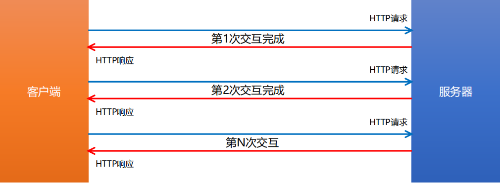

### HTTP请求消息

#### 什么是HTTP请求消息

由于 `HTTP` 协议属于客户端浏览器和服务器之间的通信协议。因此，客户端发起的请求叫做 **HTTP 请求**，客户端发送到服务器的消息，叫做 **HTTP 请求消息**。

**注意：**`HTTP` 请求消息又叫做 `HTTP` 请求报文

#### HTTP请求消息的组成部分(⭐⭐⭐)

`HTTP` 请求消息由请求行（`request line`）、请求头部（ `header` ） 、空行 和 请求体 4 个部分组成。

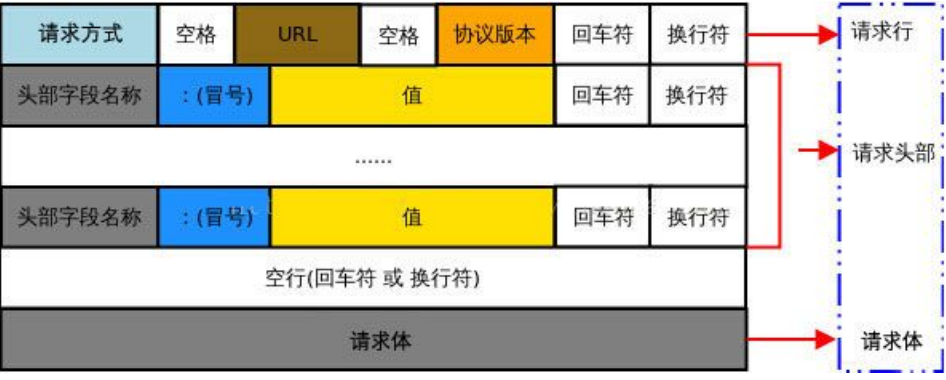

**1. 请求行**

**请求行**由**请求方式**、**URL** 和 **HTTP 协议版本** 3 个部分组成，他们之间使用空格隔开。


**2. 请求头部**

**请求头部**用来描述客户端的基本信息，从而把客户端相关的信息告知服务器。比如：User-Agent 用来说明当前是什么类型的浏览器；

`Content-Type` 用来描述发送到服务器的数据格式；Accept 用来描述客户端能够接收什么类型的返回内容；`Accept-Language` 用来描述客户端期望接收哪种人类语言的文本内容。

请求头部由多行 **键/值对** 组成，每行的键和值之间用英文的冒号分隔


关于更多请求头字段的描述，可以查看 `MDN` 官方文档：https://developer.mozilla.org/zh-CN/docs/Web/HTTP/Headers

**3. 空行**

最后一个请求头字段的后面是一个**空行**，通知服务器**请求头部至此结束**。

请求消息中的**空行**，用来分隔请求头部与请求体


**4. 请求体**

请求体中存放的，是要通过 `POST` 方式提交到服务器的数据。


**注意**：只有 `POST` 请求才**有请求体**，`GET` 请求**没有请求体**！


### HTTP响应消息

#### 什么是HTTP响应消息

**响应消息**就是服务器响应给客户端的消息内容，也叫作**响应报文**。

#### HTTP响应消息的组成部分(⭐⭐⭐)

HTTP响应消息由**状态行**、**响应头部**、**空行** 和 **响应体** 4 个部分组成，如下图所示：

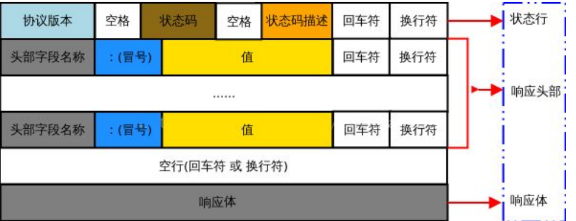

 **1. 状态行**

**状态行**由 **HTTP 协议版本**、**状态码**和**状态码的描述文本** 3 个部分组成，他们之间使用空格隔开

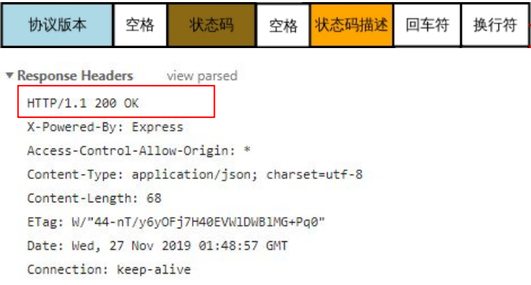

**2. 响应头部**

**响应头部**用来描述**服务器的基本信息**。响应头部由多行 **键/值对** 组成，每行的键和值之间用英文的冒号分隔。

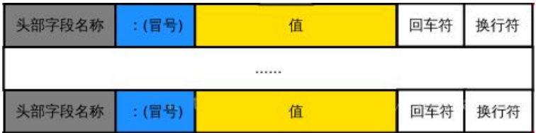

### 响应头部 – 常见的响应头字段

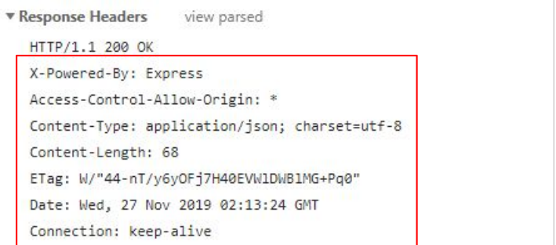

关于更多响应头字段的描述，可以查看 `MDN` 官方文档：https://developer.mozilla.org/zh-CN/docs/Web/HTTP/Headers

**3. 空行**

在最后一个响应头部字段结束之后，会紧跟一个**空行**，用来通知客户端**响应头部至此结束**。

响应消息中的空行，用来分隔**响应头部**与**响应体**。


**4. 响应体**

响应体中存放的，是服务器响应给客户端的资源内容。

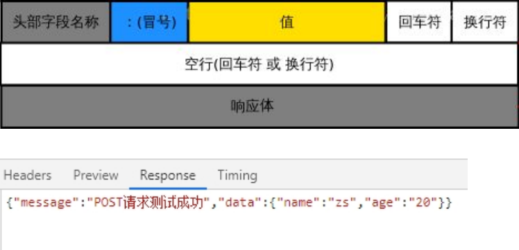

### HTTP请求方法

## 什么是HTTP请求方法

HTTP 请求方法，属于 HTTP 协议中的一部分，请求方法的作用是：用来表明**要对服务器上的资源执行的操作**。最常用的请求方法是 `GET` 和 `POST`。

## HTTP的请求方法(⭐⭐⭐)

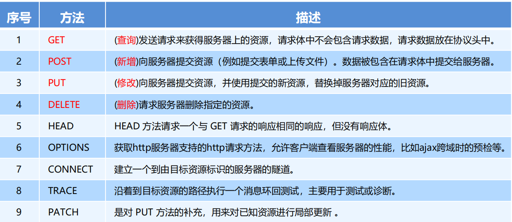

# HTTP响应状态码

## 什么是HTTP响应状态码

**HTTP 响应状态码**（`HTTP Status Code`），也属于 `HTTP` 协议的一部分，用来标识响应的状态。

响应状态码会随着响应消息一起被发送至客户端浏览器，浏览器根据服务器返回的响应状态码，就能知道这次

`HTTP` 请求的结果是成功还是失败了。

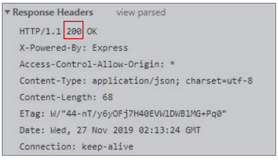

## HTTP响应状态码的组成及分类

HTTP 状态码由**三个十进制数字组成**，**第一个十进制数字定义了状态码的类型**，后两个数字**用来对状态码进行细分**。

HTTP 状态码共分为 5 种类型：

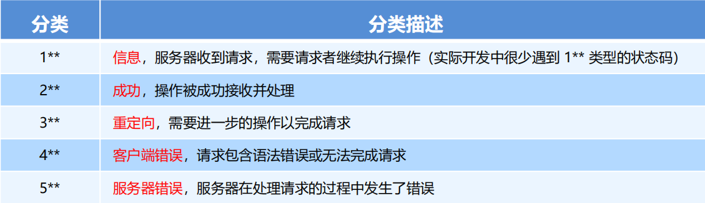

完整的 HTTP 响应状态码，可以参考 `MDN` 官方文档 https://developer.mozilla.org/zh-CN/docs/Web/HTTP/Status

## 常见的HTTP响应状态码(⭐⭐⭐)

###  2** 成功相关的响应状态码

2** 范围的状态码，表示服务器已成功接收到请求并进行处理。常见的 2** 类型的状态码如下：

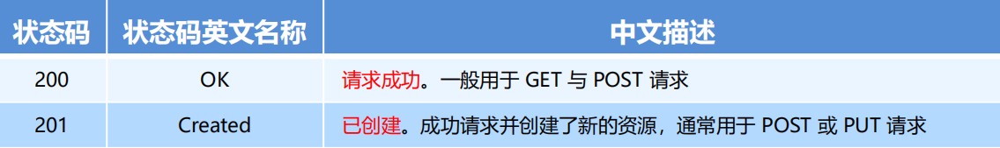

### 3** 重定向相关的响应状态码

3** 范围的状态码，表示表示服务器要求客户端重定向，需要客户端进一步的操作以完成资源的请求。常见的 3** 类型的状态码如下：

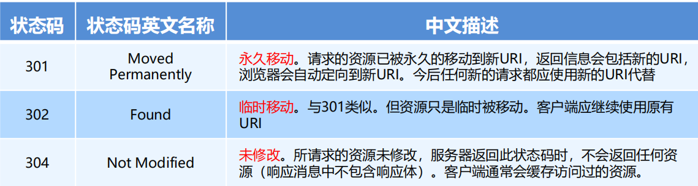

### 4\** 客户端错误相关的响应状态码

4** 范围的状态码，表示客户端的请求有非法内容，从而导致这次请求失败。常见的 4** 类型的状态码如下：

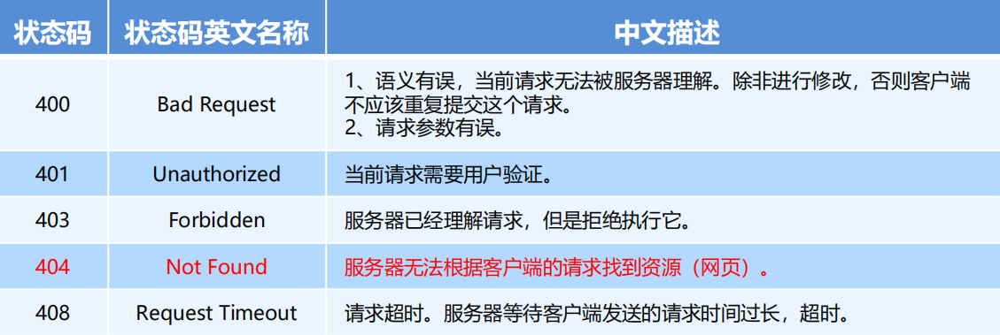

### 5\** 服务端错误相关的响应状态码

5** 范围的状态码，表示服务器未能正常处理客户端的请求而出现意外错误。常见的 5** 类型的状态码如下

