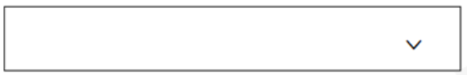
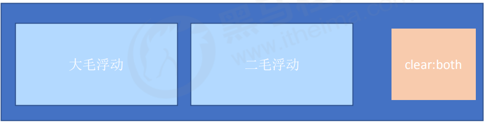

#CSS3 的新特性
css3新增的属性选择器是为了让我们更自由选择目标元素
## 1. 属性选择器
+ **属性选择器可以根据元素特定属性的来选择元素。 这样就可以不用借助于类或者id选择器。**

|选择符| 简介|
|---| ---|
|E[att]|选择具有<em>att</em>属性的的E元素|
|E[att="val"]|选择att属性值等于val的E元素|
|E[att^="val"]| 匹配具有att属性且值以val开头的E元素|
|E[att$="val"]|匹配具有att属性且值以val结尾的E元素|
|E[att*="val"]|匹配具有att属性且值中含有val的E元素|

注意：类选择器、属性选择器、伪类选择器，权重为 10。

## 2. 结构伪类选择器
+ **结构伪类选择器主要根据文档结构来选择器元素， 常用于根父级选择器里面的子元素**

|选择符|借鉴|
|---|---|
|E:first-child|匹配父元素第一个子元素E|
|E:last-child|匹配父元素最后一个子元素E|
|E:nth-child|匹配父元素中第n个子元素E|
|E:firsst-of-type|指定类型E的第一个|
|E:last-ot-type|指定类型E最后一个|
|E:nth-of-type（n）font|指定类型E的第n个|
<font color="red">注意：nth-child和nth-of-type的差别，nth-child先找孩子然后和E匹配，不符合不能选择。nth-of-type先找E属性然后再在里面找孩子。</font>

+ **结构伪类选择器可以选择多个特定的子元素**

|公式|取值|
|---|---|
|2n|偶数|
|2n+1|奇数|
|5n|5 10 15...|
|n+5|从第5个开始(包含第五个)到最后|
|-n+5|前5个(包含第5个) ..|

<font>注意：n是从0开始计算的</font>

## 3. 伪元素选择器
### 1. 伪元素选择器语法
**伪元素选择器可以帮助我们利用CSS创建新标签元素，而不需要HTML标签，从而简化HTML结构。**

|选择符|简介|
|---|---|
|::before|在元素内部的前面插入内容|
|::after|在元素内部的后面插入内容|
<font color="red">注意：</font> 
+ before 和 after 创建一个元素，但是属于行内元素
+ 新创建的这个元素在文档树中是找不到的，所以我们称为伪元素
+ 语法： element::before {} 
+ before 和 after 必须有 content 属性
+ before 在父元素内容的前面创建元素，after 在父元素内容后面插入元素
+ 伪元素选择器和标签选择器一样，权重为 1

### 2. **伪元素的使用场景**
1. 伪元素字体图标


```css
 p::before {
 position: absolute;
 right: 20px;
 top: 10px;
 content: '\e91e';
 font-size: 20px;
 }
 ```

 2. 伪元素结合：hover使用
 ```css
 /* 当我们鼠标经过了 土豆这个盒子，就让里面before遮罩层显示出来 */ .tudou:hover::before {
 /* 而是显示元素 */
 display: block;
}
```
3. 可以利用伪元素清除浮动

清除浮动效果的方法：
<font color="red">1. 额外标签法也称为隔墙法，是 W3C 推荐的做法。
2. 父级添加 overflow 属性
3. 父级添加after伪元素
4. 父级添加双伪元素</font>


**额外标签法也称为隔墙法，是 W3C 推荐的做法。**


<font color="red">注意：添加的盒子要是块级盒子</font>

**伪元素清除浮动**
在盒子后面添加一个伪元素使其实现隔墙法
```css
.clearfix:after { 
 content: ""; 
 display: block; 
 height: 0; 
 clear: both; 
 visibility: hidden;
 ```

**后面两种伪元素清除浮动算是第一种额外标签法的一个升级和优化。**
```css
.clearfix:before,.clearfix:after {
 content:"";
 display:table; //将伪元素转化伪块级元素并在一行显示
}.clearfix:after {
 clear:both; }
 ```

 ## css3盒子模型
 CSS3 中可以通过 box-sizing 来指定盒模型，有2个值：即可指定为 content-box、border-box，这样我们计算盒子大小的方式就发生了改变。
可以分成两种情况：
1. box-sizing: content-box 盒子大小为 width + padding + border （以前默认的）
2. box-sizing: border-box 盒子大小为 width
如果盒子模型我们改为了box-sizing: border-box ， 那padding和border就不会撑大盒子了（前提padding
和border不会超过width宽度）

##  CSS3 其他特性
1. 图片变模糊
filter CSS属性将模糊或颜色偏移等图形效果应用于元素。
```css
 filter: blur(5px); blur模糊处理 数值越大越模糊
 ```
 2. CSS3 calc 函数:
 calc() 此CSS函数让你在声明CSS属性值时执行一些计算。
 ```css
 width: calc(100% - 80px);
 ```