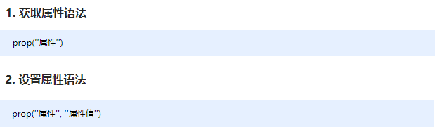
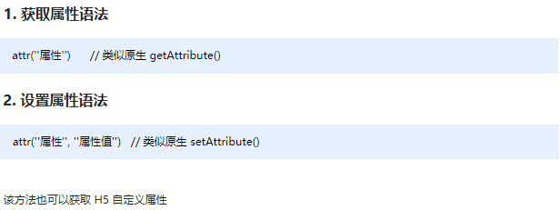
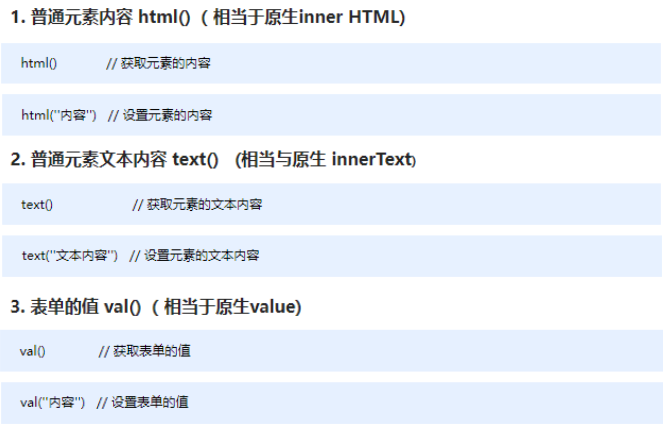
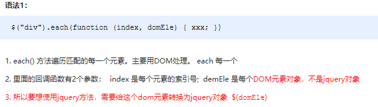
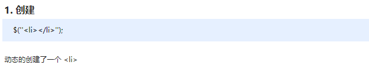
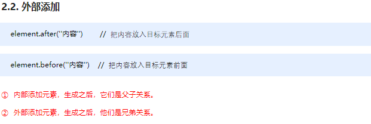
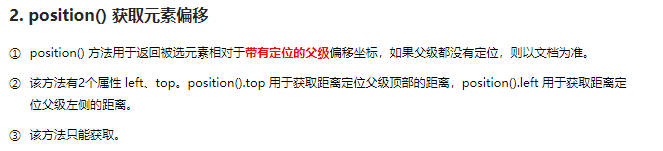

## jquery
### 1.1.1 jQuery的概念

​	jQuery总体概况如下 :

- jQuery 是一个快速、简洁的 JavaScript 库，其设计的宗旨是“write Less，Do More”，即倡导写更少的代码，做更多的事情。

- j 就是 JavaScript；   Query 查询； 意思就是查询js，把js中的DOM操作做了封装，我们可以快速的查询使用里面的功能。

- jQuery 封装了 JavaScript 常用的功能代码，优化了 DOM 操作、事件处理、动画设计和 Ajax 交互。

- 学习jQuery本质： 就是学习调用这些函数（方法）。

- jQuery 出现的目的是加快前端人员的开发速度，我们可以非常方便的调用和使用它，从而提高开发效率。
优点：轻量级，文件只有几十kb，支持链式编程，隐式迭代，具有丰富的扩展插件，而且免费开源。
### 1.2.1 jQuery的入口函数

```
//页面DOM加载完执行里面的代码
$(function () {
    此处事务处理...
})
//页面DOM加载完执行里面的代码
$(document).ready(function () {
    此处事务处理...
})
```
+ 注意点：两个入口函数功能一样，相当于原生js里面的DOMContentLoaded，等着 DOM 结构渲染完毕即可执行内部代码，不必等到所有外部资源加载完成。不同于原生 js 中的 load 事件是等页面文档、外部的 js 文件、css文件、图片加载完毕才执行内部代码。

### 1.2.6.  jQuery 对象和 DOM 对象转换

    1.jQuery的顶级对象有：$和jQuery两个，但一般为了方便都是使用$。

    2.对jQuery对象和DOM对象的解释：
    a. 用原生 JS 获取来的对象就是 DOM 对象
    b. jQuery 方法获取的元素就是 jQuery 对象。
    c. jQuery 对象本质是： <font style="color:red;">利用$对DOM 对象包装后产生的对象（伪数组形式存储）。</font>

    3.对象相互转换：
```javascript
// 1.DOM对象转换成jQuery对象，方法只有一种
var box = document.getElementById('box');  // 获取DOM对象
var jQueryObject = $(box);  // 把DOM对象转换为 jQuery 对象

// 2.jQuery 对象转换为 DOM 对象有两种方法：
//   2.1 jQuery对象[索引值]
var domObject1 = $('div')[0]

//   2.2 jQuery对象.get(索引值)
var domObject2 = $('div').get(0)
 
```
### 1.3. jQuery 选择器
#### 1.3.1. 基础选择器

#### 1.3.2. 层级选择器
层级选择器最常用的两个分别为：后代选择器和子代选择器。

​	
#### 1.3.3. 筛选选择器

​	筛选选择器，顾名思义就是在所有的选项中选择满足条件的进行筛选选择。常见如下 :


另:  jQuery中还有一些筛选方法，类似DOM中的通过一个节点找另外一个节点，父、子、兄以外有所加强。


### 1.3.4 知识铺垫

- jQuery 设置样式

```javascript
$('div').css('属性', '值')    
```

- jQuery 里面的排他思想

```javascript
// 想要多选一的效果，排他思想：当前元素设置样式，其余的兄弟元素清除样式。
$(this).css(“color”,”red”);
$(this).siblings(). css(“color”,””);
```

- 隐式迭代

```javascript
// 遍历内部 DOM 元素（伪数组形式存储）的过程就叫做隐式迭代。
// 简单理解：给匹配到的所有元素进行循环遍历，执行相应的方法，而不用我们再进行循环，简化我们的操作，方便我们调用。
$('div').hide();  // 页面中所有的div全部隐藏，不用循环操作
```

- 链式编程

```javascript
// 链式编程是为了节省代码量，看起来更优雅。
$(this).css('color', 'red').sibling().css('color', ''); 
```
###  操作 css 方法

​	**直接操作DMO元素样式常用以下三种形式 :**

```javascript
// 1.参数只写属性名，则是返回属性值
var strColor = $(this).css('color');

// 2.  参数是属性名，属性值，逗号分隔，是设置一组样式，属性必须加引号，值如果是数字可以不用跟单位和引号
$(this).css(''color'', ''red'');

// 3.  参数可以是对象形式，方便设置多组样式。属性名和属性值用冒号隔开， 属性可以不用加引号
$(this).css({ "color":"white","font-size":"20px"});

```

​	注意：css() 多用于样式少时操作，多了则不太方便。

**设置类样式方法**

​	作用等同于以前的 classList，可以操作类样式， 注意操作类里面的参数不要加点。

​	常用的三种设置类样式方法：

```javascript
// 1.添加类
$("div").addClass("current");

// 2.删除类
$("div").removeClass("current");

// 3.切换类
$("div").toggleClass("current");

```

​	注意：

1. 设置类样式方法比较适合样式多时操作，可以弥补css()的不足。
2. 原生 JS 中 className 会覆盖元素原先里面的类名，jQuery 里面类操作只是对指定类进行操作，不影响原先的类名。
### 1.5. jQuery 效果

​	jQuery 给我们封装了很多动画效果，最为常见的如下：

- 显示隐藏：show() / hide() / toggle() ;
- 划入画出：slideDown() / slideUp() / slideToggle() ; 
- 淡入淡出：fadeIn() / fadeOut() / fadeToggle() / fadeTo() ; 
- 自定义动画：animate() ;

> 注意：
>
> 动画或者效果一旦触发就会执行，如果多次触发，就造成多个动画或者效果排队执行。
>
> jQuery为我们提供另一个方法，可以停止动画排队：stop() ;

#### 1.5.1. 显示隐藏

​	显示隐藏动画，常见有三个方法：show() / hide() / toggle() ;

​	语法规范如下:


#### 1.5.2. 滑入滑出

​	滑入滑出动画，常见有三个方法：slideDown() / slideUp() / slideToggle() ; 

​	语法规范如下:


#### 1.5.3 淡入淡出

​	淡入淡出动画，常见有四个方法：fadeIn() / fadeOut() / fadeToggle() / fadeTo() ; 

​	语法规范如下:


#### 1.5.4 自定义动画

​	自定义动画非常强大，通过参数的传递可以模拟以上所有动画，方法为：animate() ;

​	语法规范如下:


**停止动画排队**

​	动画或者效果一旦触发就会执行，如果多次触发，就造成多个动画或者效果排队执行。

​	停止动画排队的方法为：stop() ; 

- stop() 方法用于停止动画或效果。
- stop() 写到动画或者效果的前面， 相当于停止结束上一次的动画。

​        总结: 每次使用动画之前，先调用 stop() ,在调用动画。
#### 1.5.6. 事件切换

​	jQuery中为我们添加了一个新事件 hover() ; 功能类似 css 中的伪类 :hover 。介绍如下

**语法**

```javascript
hover([over,]out)     // 其中over和out为两个函数
```

- over:鼠标移到元素上要触发的函数（相当于mouseenter）
- out:鼠标移出元素要触发的函数（相当于mouseleave）
- 如果只写一个函数，则鼠标经过和离开都会触发它


### 1.1. jQuery 属性操作

​	jQuery 常用属性操作有三种：prop() / attr() / data() ;

### 1.1.1 元素固有属性值 prop()

​	所谓元素固有属性就是元素本身自带的属性，比如 <a> 元素里面的 href ，比如 <input> 元素里面的 type。 

**语法**



​	注意：prop() 除了普通属性操作，更适合操作表单属性：disabled / checked / selected 等。
### 1.1.2 元素自定义属性值 attr()

​	用户自己给元素添加的属性，我们称为自定义属性。 比如给 div 添加 index =“1”。 

**语法**



​	注意：attr() 除了普通属性操作，更适合操作自定义属性。（该方法也可以获取 H5 自定义属性）

### 1.1.3 数据缓存 data()

​	data() 方法可以在指定的元素上存取数据，并不会修改 DOM 元素结构。一旦页面刷新，之前存放的数据都将被移除。 

**语法**


​	注意：同时，还可以读取 HTML5 自定义属性  data-index ，得到的是数字型。
## 1.2. jQuery 文本属性值

​	jQuery的文本属性值常见操作有三种：html() / text() / val() ; 分别对应JS中的 innerHTML 、innerText 和 value 属性。

### 1.2.1 jQuery内容文本值

​	常见操作有三种：html() / text() / val() ; 分别对应JS中的 innerHTML 、innerText 和 value 属性，主要针对元素的内容还有表单的值操作。

**语法**



​	注意：html() 可识别标签，text() 不识别标签。
### 1.3. jQuery 元素操作

​	jQuery 元素操作主要讲的是用jQuery方法，操作标签的遍历、创建、添加、删除等操作。

#### 1.3.1. 遍历元素

​	jQuery 隐式迭代是对同一类元素做了同样的操作。 如果想要给同一类元素做不同操作，就需要用到遍历。

**语法1**



​	注意：此方法用于遍历 jQuery 对象中的每一项，回调函数中元素为 DOM 对象，想要使用 jQuery 方法需要转换。

**语法2**


​	注意：此方法用于遍历 jQuery 对象中的每一项，回调函数中元素为 DOM 对象，想要使用 jQuery 方法需要转换。
#### 1.3.3. 创建、添加、删除

​	jQuery方法操作元素的创建、添加、删除方法很多，则重点使用部分，如下：

**语法总和**







​	注意：以上只是元素的创建、添加、删除方法的常用方法，其他方法请参详API。

### 1.4.1.  jQuery 尺寸操作

​	 jQuery 尺寸操作包括元素宽高的获取和设置，且不一样的API对应不一样的盒子模型。

**语法**


### 1.4.2. jQuery 位置操作

​	jQuery的位置操作主要有三个： offset()、position()、scrollTop()/scrollLeft() , 具体介绍如下: 

**语法**





### 1.1. jQuery 事件注册

​	jQuery 为我们提供了方便的事件注册机制，是开发人员抑郁操作优缺点如下：

- 优点: 操作简单，且不用担心事件覆盖等问题。
- 缺点: 普通的事件注册不能做事件委托，且无法实现事件解绑，需要借助其他方法。

**语法**


## 1.2. jQuery 事件处理

​	因为普通注册事件方法的不足，jQuery又开发了多个处理方法，重点讲解如下：

- on(): 用于事件绑定，目前最好用的事件绑定方法
- off(): 事件解绑
- trigger() / triggerHandler(): 事件触发

### 1.2.1 事件处理 on() 绑定事件

​	因为普通注册事件方法的不足，jQuery又创建了多个新的事件绑定方法bind() / live() / delegate() / on()等，其中最好用的是: on()

**语法**


### 1.2.3. 事件处理 off() 解绑事件

​	当某个事件上面的逻辑，在特定需求下不需要的时候，可以把该事件上的逻辑移除，这个过程我们称为事件解绑。jQuery 为我们提供 了多种事件解绑方法：die() / undelegate() / off() 等，甚至还有只触发一次的事件绑定方法 one()，在这里我们重点讲解一下 off() ;

**语法**


### 1.2.4. 事件处理 trigger() 自动触发事件

​	有些时候，在某些特定的条件下，我们希望某些事件能够自动触发, 比如轮播图自动播放功能跟点击右侧按钮一致。可以利用定时器自动触发右侧按钮点击事件，不必鼠标点击触发。由此 jQuery 为我们提供了两个自动触发事件 trigger() 和 triggerHandler() ; 

**语法**


### 1.3. jQuery 事件对象

​	jQuery 对DOM中的事件对象 event 进行了封装，兼容性更好，获取更方便，使用变化不大。事件被触发，就会有事件对象的产生。

**语法**


### 1.4.  jQuery 拷贝对象

​	jQuery中分别为我们提供了两套快速获取和设置元素尺寸和位置的API，方便易用，内容如下。

**语法**


### 1.5.  jQuery 多库共存

​	实际开发中，很多项目连续开发十多年，jQuery版本不断更新，最初的 jQuery 版本无法满足需求，这时就需要保证在旧有版本正常运行的情况下，新的功能使用新的jQuery版本实现，这种情况被称为，jQuery 多库共存。

**语法**


### 1.6.  jQuery 插件

​	jQuery 功能比较有限，想要更复杂的特效效果，可以借助于 jQuery 插件完成。 这些插件也是依赖于jQuery来完成的，所以必须要先引入

jQuery文件，因此也称为 jQuery 插件。

​	jQuery 插件常用的网站：

1.  jQuery 插件库  http://www.jq22.com/     
2.  jQuery 之家   http://www.htmleaf.com/ 

   jQuery 插件使用步骤：

3.  引入相关文件。（jQuery 文件 和 插件文件）    
4.  复制相关html、css、js (调用插件)。
