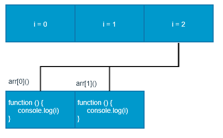

## js高级用法
**js:面向对象的弱类型脚本语言,不需要编译，在浏览器上直接被js引擎解析。**

1. 面向过程：
- 面向过程就是分析出解决问题所需要的步骤，然后用函数把这些步骤一步一步实现，使用的时候再一个一个的依次调用就可以了。
2. 面向对象：
- 面向对象是把事务分解成为一个个对象，然后由对象之间分工与合作。
3. 面向过程与面向对象对比：

|      | 面向过程                                    | 面向对象                                     |
| ---- | --------------------------------------- | ---------------------------------------- |
| 优点   | 性能比面向对象高，适合跟硬件联系很紧密的东西，例如单片机就采用的面向过程编程。 | 易维护、易复用、易扩展，由于面向对象有封装、继承、多态性的特性，可以设计出低耦合的系统，使系统 更加灵活、更加易于维护 |
| 缺点   | 不易维护、不易复用、不易扩展                          | 性能比面向过程低                                 |
### 对象与类
1. 对象：
对象是由属性和方法组成的：是一个无需键值对的集合,指的是一个具体的事物

- 属性：事物的特征，在对象中用属性来表示（常用名词）
- 方法：事物的行为，在对象中用方法来表示（常用动词） 
2. 类：
- 在 ES6 中新增加了类的概念，可以使用 class 关键字声明一个类，之后以这个类来实例化对象。类抽象了对象的公共部分，它泛指某一大类（class）对象特指某一个，通过类实例化一个具体的对象
实例：
```js
//步骤1 使用class关键字
class Person {
  constructor(name,age) {   // constructor 构造器或者构造函数
      this.name = name;
      this.age = age;
    }/------------------------------------------->注意,方法与方法之间不需要添加逗号
   say() {
      console.log(this.name + '你好');
   }
}       

//步骤2使用定义的类创建实例  注意new关键字
var ldh = new Person('刘德华', 18); 
ldh.say()   
```
**注意哟:**

1. 通过class 关键字创建类, 类名我们还是习惯性定义首字母大写
2. 类里面有个constructor 函数,可以接受传递过来的参数,同时返回实例对象
3. constructor 函数 只要 new 生成实例时,就会自动调用这个函数, 如果我们不写这个函数,类也会自动生成这个函数
4. 多个函数方法之间不需要添加逗号分隔
5. 生成实例 new 不能省略
6. 语法规范, 创建类 类名后面不要加小括号,生成实例 类名后面加小括号, 构造函数不需要加function

### 类的继承
实例：

```js
class Father {
      constructor(surname) {
        this.surname= surname;
      }
      say() {
        console.log('你的姓是' + this.surname);
       }
}

class Son extends Father{  // 这样子类就继承了父类的属性和方法
}
var damao= new Son('刘');
damao.say();      //结果为 你的姓是刘
```

 子类使用super关键字访问父类的方法：
   ```js
  //定义了父类
  class Father {
     constructor(x, y) {
     this.x = x;
     this.y = y;
     }
     sum() {
     console.log(this.x + this.y);
  	}
   }
  //子元素继承父类
      class Son extends Father {
     		 constructor(x, y) {
      		super(x, y); //使用super调用了父类中的构造函数
      	}
      }
      var son = new Son(1, 2);
      son.sum(); //结果为3
  ```

  **注意:** 

  1. 继承中,如果实例化子类输出一个方法,先看子类有没有这个方法,如果有就先执行子类的

  2. 继承中,如果子类里面没有,就去查找父类有没有这个方法,如果有,就执行父类的这个方法(就近原则)

  3. <font style="color:red;">如果子类想要继承父类的方法,同时在自己内部扩展自己的方法,利用super 调用父类的构造函数,super 必须在子类this之前调用 （super只是继承了父类的构造函数，其他的好像没啥影响，而且好像也不影响父类）；</font>

### 构造函数和原型


#### 对象的三种创建方式--复习

1. 字面量方式

   ```js
   var obj = {};
   ```

2. new关键字

   ```js
   var obj = new Object();
   ```

3. 构造函数方式

   ```js
   function Person(name,age){
     this.name = name;
     this.age = age;
   }
   var obj = new Person('zs',12);
   ```

#### 静态成员和实例成员
   1. 实例成员：实例成员就是构造函数内部通过this添加的成员 如下列代码中uname age sing 就是实例成员,实例成员只能通过实例化的对象来访问

    ```js
    function Star(uname, age) {
        this.uname = uname;
        this.age = age;
        this.sing = function() {
        console.log('我会唱歌');
        }
    }
    var ldh = new Star('刘德华', 18);
    console.log(ldh.uname);//实例成员只能通过实例化的对象来访问
    ```
    2. 静态成员：静态成员 在构造函数本身上添加的成员  如下列代码中 sex 就是静态成员,静态成员只能通过构造函数来访问
     ```js
     function Star(uname, age) {
         this.uname = uname;
         this.age = age;
         this.sing = function() {
         console.log('我会唱歌');
         }
     }
     Star.sex = '男';
     var ldh = new Star('刘德华', 18);
     console.log(Star.sex);//静态成员只能通过构造函数来访问
     ```
#### 构造函数的问题
构造函数方法很好用，但是存在浪费内存的问题。

#### 构造函数原型prototype
构造函数通过原型分配的函数是所有对象所共享的。

JavaScript 规定，每一个构造函数都有一个prototype 属性，指向另一个对象。注意这个prototype就是一个对象，这个对象的所有属性和方法，都会被构造函数所拥有。

我们可以把那些不变的方法，直接定义在 prototype 对象上，这样所有对象的实例就可以共享这些方法。
#### 对象原型
```html
对象都会有一个属性 __proto__ 指向构造函数的 prototype 原型对象，之所以我们对象可以使用构造函数 prototype 原型对象的属性和方法，就是因为对象有 __proto__ 原型的存在。
__proto__对象原型和原型对象 prototype 是等价的
__proto__对象原型的意义就在于为对象的查找机制提供一个方向，或者说一条路线，但是它是一个非标准属性，因此实际开发中，不可以使用这个属性，它只是内部指向原型对象 prototype

```


#### constructor构造函数
```html
对象原型（ __proto__）和构造函数（prototype）原型对象里面都有一个属性 constructor 属性 ，constructor 我们称为构造函数，因为它指回构造函数本身。
constructor 主要用于记录该对象引用于哪个构造函数，它可以让原型对象重新指向原来的构造函数。
一般情况下，对象的方法都在构造函数的原型对象中设置。如果有多个对象的方法，我们可以给原型对象采取对象形式赋值，但是这样就会覆盖构造函数原型对象原来的内容，这样修改后的原型对象 constructor  就不再指向当前构造函数了。此时，我们可以在修改后的原型对象中，添加一个 constructor 指向原来的构造函数。
```
```js
 function Star(uname, age) {
     this.uname = uname;
     this.age = age;
 }
 // 很多情况下,我们需要手动的利用constructor 这个属性指回 原来的构造函数
 Star.prototype = {
 // 如果我们修改了原来的原型对象,给原型对象赋值的是一个对象,则必须手动的利用constructor指回原来的构造函数
   constructor: Star, // 手动设置指回原来的构造函数
   sing: function() {
     console.log('我会唱歌');
   },
   movie: function() {
     console.log('我会演电影');
   }
}
var zxy = new Star('张学友', 19);
```
#### 构造函数实例和原型对象三角关系

1. 原型链和成员的查找机制

    任何对象都有原型对象,也就是prototype属性,任何原型对象也是一个对象,该对象就有__proto__属性,这样一层一层往上找,就形成了一条链,我们称此为原型链;

    ```html
    当访问一个对象的属性（包括方法）时，首先查找这个对象自身有没有该属性。
    如果没有就查找它的原型（也就是 __proto__指向的 prototype 原型对象）。
    如果还没有就查找原型对象的原型（Object的原型对象）。
    依此类推一直找到 Object 为止（null）。
    __proto__对象原型的意义就在于为对象成员查找机制提供一个方向，或者说一条路线。
    ```

2. 原型对象中this指向

    不管构造函数中的this还是原型对象的this,都指向我们new出来的实例对象

3. 通过原型为数组扩展内置方法

    ```js
    Array.prototype.sum = function() {
    var sum = 0;
    for (var i = 0; i < this.length; i++) {
    sum += this[i];
    }
    return sum;
    };
    //此时数组对象中已经存在sum()方法了  可以始终 数组.sum()进行数据的求
    ```
### 继承


#### call()

- call()可以调用函数
- call()可以修改this的指向,使用call()的时候 参数一是修改后的this指向,参数2,参数3..使用逗号隔开连接
```js
 function fn(x, y) {
     console.log('我想喝手磨咖啡');
     console.log(this);
     console.log(x + y);
}
  var o = {
  	name: 'andy'
  };
  // fn();
  // 1. call() 可以调用函数
  // fn.call();
  // 2. call() 可以改变这个函数的this指向 此时这个函数的this 就指向了o这个对象
  fn.call(o, 1, 2);
```

#### 子构造函数继承父构造函数中的属性

1. 先定义一个父构造函数
2. 再定义一个子构造函数
3. 子构造函数继承父构造函数的属性(使用call方法)


```js
 // 1. 父构造函数
 function Father(uname, age) {
   // this 指向父构造函数的对象实例
   this.uname = uname;
   this.age = age;
 }
  // 2 .子构造函数 
function Son(uname, age, score) {
  // this 指向子构造函数的对象实例
  3.使用call方式实现子继承父的属性
  Father.call(this, uname, age);
  this.score = score;
}
var son = new Son('刘德华', 18, 100);
console.log(son);
```

#### 借用原型对象继承方法

1. 先定义一个父构造函数
2. 再定义一个子构造函数
3. 子构造函数继承父构造函数的属性(使用call方法)

```js
// 1. 父构造函数
function Father(uname, age) {
  // this 指向父构造函数的对象实例
  this.uname = uname;
  this.age = age;
}
Father.prototype.money = function() {
  console.log(100000);
 };
 // 2 .子构造函数 
  function Son(uname, age, score) {
      // this 指向子构造函数的对象实例
      Father.call(this, uname, age);
      this.score = score;
  }
// Son.prototype = Father.prototype;  这样直接赋值会有问题,如果修改了子原型对象,父原型对象也会跟着一起变化
  Son.prototype = new Father();
  // 如果利用对象的形式修改了原型对象,别忘了利用constructor 指回原来的构造函数
  Son.prototype.constructor = Son;
  // 这个是子构造函数专门的方法
  Son.prototype.exam = function() {
    console.log('孩子要考试');

  }
  var son = new Son('刘德华', 18, 100);
  console.log(son);
```

### ES5新增方法
#### 数组方法forEach遍历数组

```js
 arr.forEach(function(value, index, array) {
       //参数一是:数组元素
       //参数二是:数组元素的索引
       //参数三是:当前的数组
 })
  //相当于数组遍历的 for循环 没有返回值
```


#### 数组方法filter过滤数组

```js
  var arr = [12, 66, 4, 88, 3, 7];
  var newArr = arr.filter(function(value, index,array) {
  	 //参数一是:数组元素
     //参数二是:数组元素的索引
     //参数三是:当前的数组
     return value >= 20;
  });
  console.log(newArr);//[66,88] //返回值是一个新数组
```

#### 数组方法some

```js
some 查找数组中是否有满足条件的元素 
 var arr = [10, 30, 4];
 var flag = arr.some(function(value,index,array) {
    //参数一是:数组元素
     //参数二是:数组元素的索引
     //参数三是:当前的数组
     return value < 3;
  });
console.log(flag);//返回值是布尔值,只要查找到满足条件的一个元素就立马终止循环
```
#### 获取对象的属性名

Object.keys(对象) 获取到当前对象中的属性名 ，返回值是一个数组

```js
 var obj = {
     id: 1,
     pname: '小米',
     price: 1999,
     num: 2000
};
var result = Object.keys(obj)
console.log(result)//[id，pname,price,num]
```

#### Object.defineProperty <font style="color:red;">重点</font>


Object.defineProperty设置或修改对象中的属性

```js
Object.defineProperty(对象，修改或新增的属性名，{
		value:修改或新增的属性的值,
		writable:true/false,//如果值为false 不允许修改这个属性值
		enumerable: false,//enumerable 如果值为false 则不允许遍历
        configurable: false  //configurable 如果为false 则不允许删除这个属性 属性是否可以被删除或是否可以再次修改特性
})	
```
**configurable为flase时，weiteable可以由true改成flase但是不能由flase改成true，这好像跟权限有关**

### 函数的定义和调用

#### 函数的定义方式

1. 方式1 函数声明方式 function 关键字 (命名函数)

   ```js
   function fn(){}
   ```

2. 方式2 函数表达式(匿名函数)

   ```js
   var fn = function(){}
   ```

3. 方式3 new Function() 

   ```js
   var f = new Function('a', 'b', 'console.log(a + b)');
   f(1, 2);

   var fn = new Function('参数1','参数2'..., '函数体')
   注意
   /*Function 里面参数都必须是字符串格式
   第三种方式执行效率低，也不方便书写，因此较少使用
   所有函数都是 Function 的实例(对象)  
   函数也属于对象
   */
   ```

#### 函数的调用

```js
/* 1. 普通函数 */
function fn() {
	console.log('人生的巅峰');
}
 fn(); 
/* 2. 对象的方法 */
var o = {
  sayHi: function() {
  	console.log('人生的巅峰');
  }
}
o.sayHi();
/* 3. 构造函数*/
function Star() {};
new Star();
/* 4. 绑定事件函数*/
 btn.onclick = function() {};   // 点击了按钮就可以调用这个函数
/* 5. 定时器函数*/
setInterval(function() {}, 1000);  这个函数是定时器自动1秒钟调用一次
/* 6. 立即执行函数(自调用函数)*/
(function() {
	console.log('人生的巅峰');
})();
```
### this

#### 函数内部的this指向

这些 this 的指向，是当我们调用函数的时候确定的。调用方式的不同决定了this 的指向不同

一般指向我们的调用者.


#### 改变函数内部 this 指向

#####  call方法

call()方法调用一个对象。简单理解为调用函数的方式，但是它可以改变函数的 this 指向

应用场景:  经常做继承. 

```js
var o = {
	name: 'andy'
}
 function fn(a, b) {
      console.log(this);
      console.log(a+b)
};
fn()// 此时的this指向的是window
fn.call(o,1,2)//此时的this指向的是对象o,参数使用逗号隔开

```

#####  apply方法

apply() 方法调用一个函数。简单理解为调用函数的方式，但是它可以改变函数的 this 指向。

应用场景:  经常跟数组有关系

```js
var o = {
	name: 'andy'
}
 function fn(a, b) {
      console.log(this);
      console.log(a+b)
};
fn()// 此时的this指向的是window
fn.apply(o,[1,2])//此时的this指向的是对象o,参数使用数组传递
```

##### bind方法

bind() 方法不会调用函数,但是能改变函数内部this 指向,返回的是原函数改变this之后产生的新函数

如果只是想改变 this 指向，并且不想调用这个函数的时候，可以使用bind

应用场景:不调用函数,但是还想改变this指向

```js
 var o = {
 name: 'andy'
 };

function fn(a, b) {
	console.log(this);
	console.log(a + b);
};
var f = fn.bind(o, 1, 2); //此处的f是bind返回的新函数
f();//调用新函数  this指向的是对象o 参数使用逗号隔开
```

#####  call、apply、bind三者的异同

- 共同点 : 都可以改变this指向
- 不同点:
  - call 和 apply  会调用函数, 并且改变函数内部this指向.
  - call 和 apply传递的参数不一样,call传递参数使用逗号隔开,apply使用数组传递
  - bind  不会调用函数, 可以改变函数内部this指向.


- 应用场景
  1. call 经常做继承. 
  2. apply经常跟数组有关系.  比如借助于数学对象实现数组最大值最小值
  3. bind  不调用函数,但是还想改变this指向. 比如改变定时器内部的this指向. 

### 严格模式
### 3.1什么是严格模式

JavaScript 除了提供正常模式外，还提供了严格模式（strict mode）。ES5 的严格模式是采用具有限制性 JavaScript变体的一种方式，即在严格的条件下运行 JS 代码。

严格模式在 IE10 以上版本的浏览器中才会被支持，旧版本浏览器中会被忽略。

严格模式对正常的 JavaScript 语义做了一些更改： 

1.消除了 Javascript 语法的一些不合理、不严谨之处，减少了一些怪异行为。

2.消除代码运行的一些不安全之处，保证代码运行的安全。

3.提高编译器效率，增加运行速度。

4.禁用了在 ECMAScript 的未来版本中可能会定义的一些语法，为未来新版本的 Javascript 做好铺垫。比如一些保留字如：class,enum,export, extends, import, super 不能做变量名
#### 开启严格模式

严格模式可以应用到整个脚本或个别函数中。因此在使用时，我们可以将严格模式分为为脚本开启严格模式和为函数开启严格模式两种情况。

- 情况一 :为脚本开启严格模式

  - 有的 script 脚本是严格模式，有的 script 脚本是正常模式，这样不利于文件合并，所以可以将整个脚本文件放在一个立即执行的匿名函数之中。这样独立创建一个作用域而不影响其他
    script 脚本文件。

    ```js
    (function (){
      //在当前的这个自调用函数中有开启严格模式，当前函数之外还是普通模式
    　　　　"use strict";
           var num = 10;
    　　　　function fn() {}
    })();
    //或者 
    <script>
      　"use strict"; //当前script标签开启了严格模式
    </script>
    <script>
      			//当前script标签未开启严格模式
    </script>
    ```
- 情况二:为函数开启严格模式
*在函数里面添加"use strict就可以了"*

### 高阶函数
高阶函数是对其他函数进行操作的函数，它接收函数作为参数或将函数作为返回值输出。


此时fn 就是一个高阶函数

函数也是一种数据类型，同样可以作为参数，传递给另外一个参数使用。最典型的就是作为回调函数。

同理函数也可以作为返回值传递回来

### 5.闭包

#### 5.1变量的作用域复习

变量根据作用域的不同分为两种：全局变量和局部变量。

1. 函数内部可以使用全局变量。
2. 函数外部不可以使用局部变量。
3. 当函数执行完毕，本作用域内的局部变量会销毁。

#### 什么是闭包

闭包（closure）指有权访问另一个函数作用域中变量的函数。简单理解就是 ，一个作用域可以访问另外一个函数内部的局部变量。 


### 5.3闭包的作用

作用：延伸变量的作用范围。

```js
 function fn() {
   var num = 10;
   function fun() {
       console.log(num);
 	}
    return fun;
 }
var f = fn();
f();
```
### 递归

#### 什么是递归

递归：如果一个函数在内部可以调用其本身，那么这个函数就是递归函数。简单理解:函数内部自己调用自己, 这个函数就是递归函数

<font style="color:red;">注意：递归函数的作用和循环效果一样，由于递归很容易发生“栈溢出”错误（stack overflow），所以必须要加退出条件return。
</font>

### 正则表达式概述

**正则表达式**

    正则表达式（ Regular Expression ）是用于匹配字符串中字符组合的模式。在JavaScript中，正则表达式也是对象。

    正则表通常被用来检索、替换那些符合某个模式（规则）的文本，例如验证表单：用户名表单只能输入英文字母、数字或者下划线， 昵称输入框中可以输入中文(匹配)。此外，正则表达式还常用于过滤掉页面内容中的一些敏感词(替换)，或从字符串中获取我们想要的特定部分(提取)等 。

    其他语言也会使用正则表达式，本阶段我们主要是利用JavaScript 正则表达式完成表单验证。

#### 正则表达式的特点

1. 灵活性、逻辑性和功能性非常的强。
2. 可以迅速地用极简单的方式达到字符串的复杂控制。
3. 对于刚接触的人来说，比较晦涩难懂。比如：^\w+([-+.]\w+)*@\w+([-.]\w+)*\.\w+([-.]\w+)*$
4. 实际开发,一般都是直接复制写好的正则表达式. 但是要求会使用正则表达式并且根据实际情况修改正则表达式.   比如用户名:  
```
/^[a-z0-9_-]{3,16}$/
```


特殊字符参考：[MDN](https://developer.mozilla.org/zh-CN/docs/Web/JavaScript/Guide/Regular_Expressions)

### ES6语法

**ES 的全称是 ECMAScript , 它是由 ECMA 国际标准化组织,制定的一项脚本语言的标准化规范。**

#### 为什么使用 ES6 ?

每一次标准的诞生都意味着语言的完善，功能的加强。JavaScript语言本身也有一些令人不满意的地方。

- 变量提升特性增加了程序运行时的不可预测性
- 语法过于松散，实现相同的功能，不同的人可能会写出不同的代码

### ES6新增语法

#### let（★★★）

ES6中新增了用于声明变量的关键字

1. let声明的变量只在所处于的块级有效

```javascript
 if (true) { 
     let a = 10;
 }
console.log(a) // a is not defined
```

**注意：**使用let关键字声明的变量才具有块级作用域，使用var声明的变量不具备块级作用域特性。

2. 不存在变量提升

```javascript
console.log(a); // a is not defined 
let a = 20;
```

3. 暂时性死区

利用let声明的变量会绑定在这个块级作用域，不会受外界的影响

```javascript
 var tmp = 123;
 if (true) { 
     tmp = 'abc';
     let tmp; 
 } 
```

4. 经典面试题

```javascript
 var arr = [];
 for (var i = 0; i < 2; i++) {
     arr[i] = function () {
         console.log(i); 
     }
 }
 arr[0]();
 arr[1]();

```



**经典面试题图解：**此题的关键点在于变量i是全局的，函数执行时输出的都是全局作用域下的i值。

```javascript
 let arr = [];
 for (let i = 0; i < 2; i++) {
     arr[i] = function () {
         console.log(i); 
     }
 }
 arr[0]();
 arr[1]();

```


**let的特点**

- let关键字就是用来声明变量的
- 使用let关键字声明的变量具有块级作用域
- 在一个大括号中 使用let关键字声明的变量才具有块级作用域 var关键字是不具备这个特点的
- 防止循环变量变成全局变量
- 使用let关键字声明的变量没有变量提升
- 使用let关键字声明的变量具有暂时性死区特性

#### const（★★★）

声明常量，常量就是值（内存地址）不能变化的量

1. 具有块级作用域

```javascript
 if (true) { 
     const a = 10;
 }
console.log(a) // a is not defined
```

2. 声明常量时必须赋值

```javascript
const PI; // Missing initializer in const declaration
```

3. 常量赋值后，值不能修改

```javascript
const PI = 3.14;
PI = 100; // Assignment to constant variable.

const ary = [100, 200];
ary[0] = 'a';
ary[1] = 'b';
console.log(ary); // ['a', 'b']; 
ary = ['a', 'b']; // Assignment to constant variable.
```

**const的特点**

- const声明的变量是一个常量
- 既然是常量不能重新进行赋值，如果是基本数据类型，不能更改值，如果是复杂数据类型，不能更改地址值
- 声明 const时候必须要给定值

#### 解构赋值（★★★）

ES6中允许从数组中提取值，按照对应位置，对变量赋值，对象也可以实现解构

1. 数组解构

```javascript
 let [a, b, c] = [1, 2, 3];
 console.log(a)//1
 console.log(b)//2
 console.log(c)//3
//如果解构不成功，变量的值为undefined
```

2. 对象解构

```javascript
 let person = { name: 'zhangsan', age: 20 }; 
 let { name, age } = person;
 console.log(name); // 'zhangsan' 
 console.log(age); // 20

 let {name: myName, age: myAge} = person; // myName myAge 属于别名
 console.log(myName); // 'zhangsan' 
 console.log(myAge); // 20

```

3. 小结

- 解构赋值就是把数据结构分解，然后给变量进行赋值
- 如果结构不成功，变量跟数值个数不匹配的时候，变量的值为undefined
- 数组解构用中括号包裹，多个变量用逗号隔开，对象解构用花括号包裹，多个变量用逗号隔开
- 利用解构赋值能够让我们方便的去取对象中的属性跟方法

#### 箭头函数（★★★）

ES6中新增的定义函数的方式。

```javascript
() => {} //()：代表是函数； =>：必须要的符号，指向哪一个代码块；{}：函数体
const fn = () => {}//代表把一个函数赋值给fn
```
**箭头函数不绑定this关键字，箭头函数中的this，指向的是函数定义位置的上下文this**


#### 剩余参数（★★）

剩余参数语法允许我们将一个不定数量的参数表示为一个数组，不定参数定义方式，这种方式很方便的去声明不知道参数情况下的一个函数

```javascript
function sum (first, ...args) {
     console.log(first); // 10
     console.log(args); // [20, 30] 
 }
 sum(10, 20, 30)

```


#### Array 的扩展方法（★★）


1. 普通用法
扩展运算符可以将数组或者对象转为用逗号分隔的参数序列

```javascript
 let ary = [1, 2, 3];
 ...ary  // 1, 2, 3
 console.log(...ary);    // 1 2 3,相当于下面的代码
 console.log(1,2,3);
```

2. 扩展运算符可以应用于合并数组

```javascript
// 方法一 
 let ary1 = [1, 2, 3];
 let ary2 = [3, 4, 5];
 let ary3 = [...ary1, ...ary2];
 // 方法二 
 ary1.push(...ary2);
```
3. 将类数组或可遍历对象转换为真正的数组

```javascript
let oDivs = document.getElementsByTagName('div'); 
oDivs = [...oDivs];
```

构造函数方法：Array.from() 将伪数组或可遍历对象转换为真正的数组


```javascript
//定义一个集合
let arrayLike = {
    '0': 'a',
    '1': 'b',
    '2': 'c',
    length: 3
}; 
//转成数组
let arr2 = Array.from(arrayLike); // ['a', 'b', 'c']
```

方法还可以接受第二个参数，作用类似于数组的map方法，用来对每个元素进行处理，将处理后的值放入返回的数组

```javascript
 let arrayLike = { 
     "0": 1,
     "1": 2,
     "length": 2
 }
 let newAry = Array.from(arrayLike, item => item *2)//[2,4]

```

注意：如果是对象，那么属性需要写对应的索引


4. 实例方法：findIndex()

用于找出第一个符合条件的数组成员的位置，如果没有找到返回-1

```javascript
let ary = [1, 5, 10, 15];
let index = ary.findIndex((value, index) => value > 9); 
console.log(index); // 2
```

5. 实例方法：includes()

判断某个数组是否包含给定的值，返回布尔值。

```javascript
[1, 2, 3].includes(2) // true 
[1, 2, 3].includes(4) // false

```
#### String 的扩展方法

1. 模板字符串（★★★）

ES6新增的创建字符串的方式，使用反引号定义

```javascript
let name = `zhangsan`;

```

2. 模板字符串中可以解析变量

```javascript
let name = '张三'; 
let sayHello = `hello,my name is ${name}`; // hello, my name is zhangsan
```

3. 模板字符串中可以换行

```javascript
 let result = { 
     name: 'zhangsan', 
     age: 20,
     sex: '男' 
 } 
 let html = ` <div>
     <span>${result.name}</span>
     <span>${result.age}</span>
     <span>${result.sex}</span>
 </div> `;

```

4. 在模板字符串中可以调用函数

```javascript
const sayHello = function () { 
    return '哈哈哈哈 追不到我吧 我就是这么强大';
 }; 
 let greet = `${sayHello()} 哈哈哈哈`;
 console.log(greet); // 哈哈哈哈 追不到我吧 我就是这么强大 哈哈哈哈

```

5. 实例方法：startsWith() 和 endsWith()

- startsWith()：表示参数字符串是否在原字符串的头部，返回布尔值
- endsWith()：表示参数字符串是否在原字符串的尾部，返回布尔值

```javascript
let str = 'Hello world!';
str.startsWith('Hello') // true 
str.endsWith('!')       // true

```

6. 实例方法：repeat()

repeat方法表示将原字符串重复n次，返回一个新字符串

```javascript
'x'.repeat(3)      // "xxx" 
'hello'.repeat(2)  // "hellohello"
```

#### Set 数据结构（★★）

ES6 提供了新的数据结构  Set。它类似于数组，但是成员的值都是唯一的，没有重复的值。

Set本身是一个构造函数，用来生成  Set  数据结构

```javascript
const s = new Set();
```

Set函数可以接受一个数组作为参数，用来初始化。

```javascript
const set = new Set([1, 2, 3, 4, 4]);//{1, 2, 3, 4}

```

1. 实例方法

- add(value)：添加某个值，返回 Set 结构本身
- delete(value)：删除某个值，返回一个布尔值，表示删除是否成功
- has(value)：返回一个布尔值，表示该值是否为 Set 的成员
- clear()：清除所有成员，没有返回值

```javascript
 const s = new Set();
 s.add(1).add(2).add(3); // 向 set 结构中添加值 
 s.delete(2)             // 删除 set 结构中的2值   
 s.has(1)                // 表示 set 结构中是否有1这个值 返回布尔值 
 s.clear()               // 清除 set 结构中的所有值
 //注意：删除的是元素的值，不是代表的索引
```

2. 遍历

Set 结构的实例与数组一样，也拥有forEach方法，用于对每个成员执行某种操作，没有返回值。

```javascript
s.forEach(value => console.log(value))

```
黑马客户端：darkhorse123