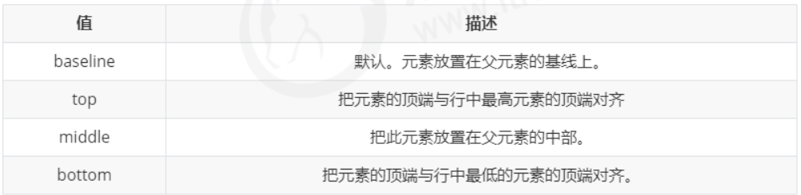
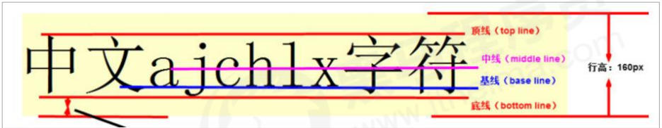

#vertical-align 属性应用
## 1. vertical-align的应用场景
CSS 的 vertical-align 属性使用场景： 经常用于设置图片或者表单(行内块元素）和文字垂直对齐。
官方解释： 用于设置一个元素的垂直对齐方式，但是它只针对于行内元素或者行内块元素有效。
语法：
```
vertical-align : baseline | top | middle | bottom
```





## 2.  图片、表单和文字对齐
图片、表单都属于行内块元素，默认的 vertical-align 是基线对齐。
此时可以给图片、表单这些行内块元素的 vertical-align 属性设置为 middle 就可以让文字和图片垂直居中对齐了。
```
css:
.weixing {
	float: right;
	width: 190px;
	height: 30px;	
}

.weixing span {
	vertical-align: middle;
}

.weixing img {
	vertical-align: middle;
}
html:
<div class="weixing">
	<span>关注我们:</span>
	
</div>
```
注意这里的span标签和img标签都要加vertiacal-align:middle才能实现效果。