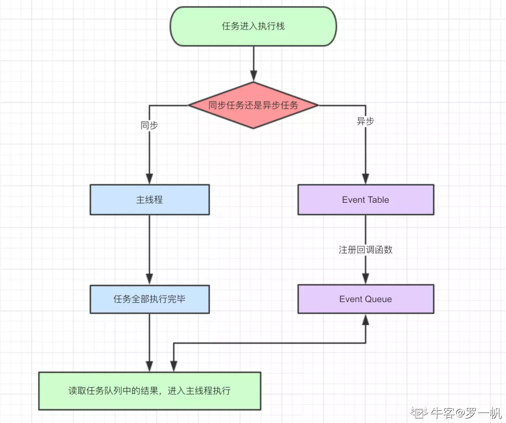
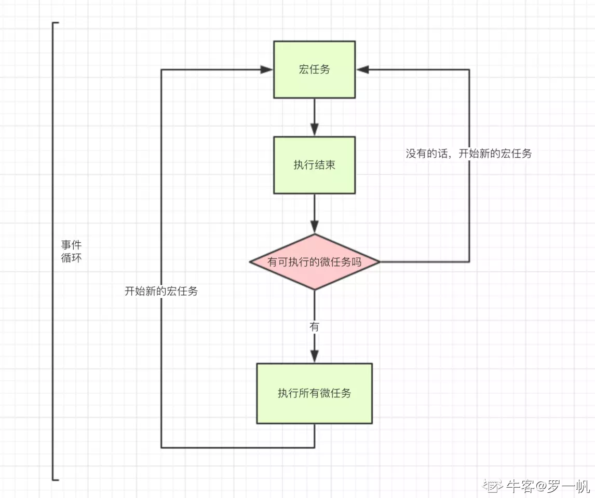

## js事件处理机制
js在处理异步操作时利用的是事件循环机制。事件循环机制处理顺序，同步操作<-异步操作(微任务<-宏任务)

由于javascript是单线程任务所以主线程只能同时处理一个任务，所以把异步的事件放在同步的事件处理完成之后再来依次处理。

异步事件又包括微任务和宏任务：

宏任务和微任务关系：微任务执行完后再执行宏任务

微任务操作：1：Promise,2:MutationObserver

宏任务操作:1:setTimeout,2:setInterval,3:I/O操作

