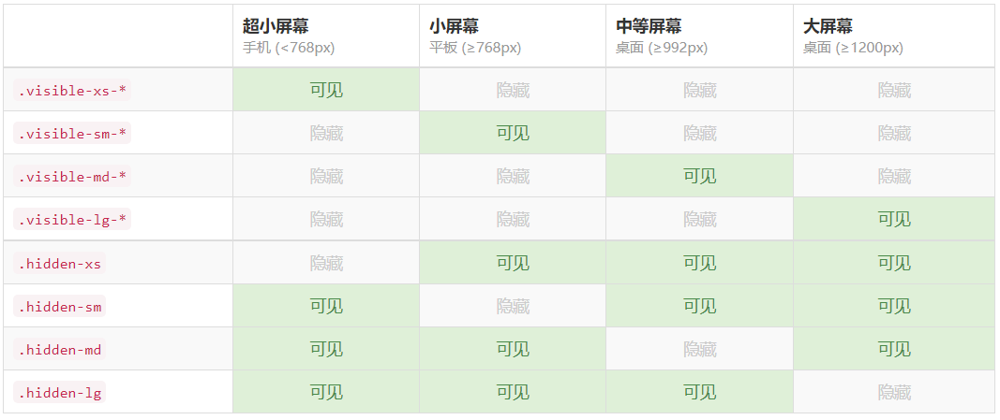

#移动端开发
##开发前准备要理解的知识点：
**1.视口** 
*布局视口（手机端默认的视口） layout viewport，一般手机浏览器都默认设置了一个布局视口，用于解决早期的PC端页面在手机上显示的问题
iOS, Android基本都将这个视口分辨率设置为 980px，所以PC上的网页大多都能在手机上呈现，只不过元素看上去很小，一般默认可以通过手动缩放网页。
**视觉视口** visual viewport用户正在看到的网站的区域
**理想视口** ideal viewport理想视口，对设备来讲，是最理想的视口尺寸*
<font style="color:red">我们使用meta视口标签的主要目的：布局视口的宽度应该与理想视口的宽度一致，简单理解就是设备有多宽，我们布局的视口就多宽</font>
**2.高清问题**
*手机端的尺寸的像素比不同就导致图片不能高清显示，要使用二倍图或者高倍图才能高清显示*
*高清图片问题原理：我们电脑看到的图像都是用一个个像素点组成的，当电脑的一个像素点不能只表示一个图像的一像素就会导致图片不能高清显示*
<font style="color:red">使用高倍图高清显示原理：我们首先准备高倍图根据实际图片宽高设置图片的宽高，背景图就通过background-size设置背景图片的宽高</font>

##技术解决方案
1. 移动端浏览器兼容问题：移动端一般都使用webkit内核，我们就考虑webkit的兼容性问题就行了。
2. 移动端的初始化：引用normalize.css进行移动端样式初始化。
3. 使用盒子模型：手机端大量使用box-sizing：border-box
4. 移动端常见布局：流式布局（百分比布局）、flexible弹性布局、less+rem+媒体查询布局、混合布局（采用集中技术进行移动端开发）、响应式（pc端和移动端采用同一套css，主要技术使bootstr和媒体查询）

##百分比布局方式
+ 流式布局，也就是百分比布局
+ 通过盒子的宽度设置成百分比来根据屏幕的宽度来进行伸缩，不受固定像素的限制，内容向两侧填充。
+ 为了保护内容在合理的范围内我们需要设置最大宽度和最小宽度
+ Max-width 最大宽
+ Min-width 最小宽

##flex布局
1. Flex布局原理就是：给父盒子添加flex属性，来控制子盒子的位置排列方式从而实现flex布局（当父元素设置了display：flex属性子元素的float、clear和vertical-align将都会失效）

2. 父元素常见属性：

|属性|值|
|---|---|
|flex-drection(描述主轴方向)|row（默认，从左到右） rew-reverse（从右到左）column（从上到下）column-reverse(从下到上)|
|justify-content(用于设置盒子元素在主轴方向上的对齐方式。)|flex-start(头部对齐从左到右) flex-end(尾部对齐) center（在主轴居中对齐） space-around（平分剩余空间） space-between（先两边紧贴，再平分剩余空间）|
|flex-warp(设置元素是否换行)|nowarp（默认，不换行） warp（换行）|
|align-items（设置元素在侧轴上的对齐方式）（单行）|flex-start(头部对齐从左到右) flex-end(尾部对齐) center（在侧轴上居中对齐）stretch（拉伸）|
|align-content（设置侧轴上子元素的对齐方式）（多行）|flex-start(头部对齐从左到右) flex-end(尾部对齐) center（在侧轴居中对齐） space-around（平分剩余空间） space-between（先两边紧贴，再平分剩余空间）starch（拉伸）|

3. 子元素的常见属性：
+  flex：定义子元素分配空间，用flex值来确定所占的空间份数。
+ align-self：控制子项自己在侧轴上的排列方式。
+ order：定义项目的排列顺序，数值越小排列越靠前。

##less+rem+媒体查询布局
###rem
*rem是一个相对单位，他相对于html的font-size的字体大小，如设置html中的font-size：12px，2rem就等于24px。rem也可以在编程软件中设置，可以自己设置1rem等于多少px值。（root rem）*
<font style="color:red">适配就是在HTML中不直接使用px作为单位，而是间接使用rem，所用的元素都是相对于HTMLfont-size的大小而定的，当HTML的font-stize发生改变，其他元素也会发生改变。</font>

###媒体查询

1. 什么是媒体查询：媒体查询是css3的新语法，它能根据在不同屏幕宽度来设置不同的样式
2. 媒体查询的用法：
+ 用 @media开头 注意@符号
+ mediatype  媒体类型
+ 关键字 and  not  only
+ media feature 媒体特性必须有小括号包含(min-width[最小宽度] max-width[最大宽度])
```
@media mediatype and|not|only (media feature) {
    CSS-Code;
}
```

###less

**1. Less介绍：**
Less（LeanerStyle Sheets 的缩写）是一门 CSS扩展语言，也成为CSS预处理器。
它在CSS 的语法基础之上，引入了变量，Mixin（混入），运算以及函数等功能，大大简化了 CSS 的编写，并且降低了 CSS的维护成本，就像它的名称所说的那样，Less可以让我们用更少的代码做更多的事情。
Less中文网址：[http://](http://lesscss.cn/)[less](http://lesscss.cn/)[css.cn/](http://lesscss.cn/)
常见的CSS预处理器：Sass、Less、Stylus

**2. less简单使用：**
Less 使用之变量

变量是指没有固定的值，可以改变的。因为我们CSS中的一些颜色和数值等经常使用。

```
@变量名:值;
```

+ 必须有@为前缀
+ 不能包含特殊字符
+ 不能以数字开头
+ 大小写敏感

```
@color: pink;
```

Less 编译 vocode Less 插件

Easy LESS 插件用来把less文件编译为css文件

安装完毕插件，重新加载下 vscode。

只要保存一下Less文件，会自动生成CSS文件。


Less 嵌套

```
// 将css改为less
#header .logo {
  width: 300px;
}

#header {
    .logo {
       width: 300px;
    }
}

```

如果遇见 （交集|伪类|伪元素选择器） ，利用&进行连接

```
a:hover{
    color:red;
}
a{
  &:hover{
      color:red;
  }
}
```

Less 运算

任何数字、颜色或者变量都可以参与运算。就是Less提供了加（+）、减（-）、乘（*）、除（/）算术运算。

```
/*Less 里面写*/
@witdh: 10px + 5;
div {
    border: @witdh solid red;
}
/*生成的css*/
div {
  border: 15px solid red;
}
/*Less 甚至还可以这样 */
width: (@width + 5) * 2;

```

+ 乘号（*）和除号（/）的写法  
+ 运算符中间左右有个空格隔开 1px + 5
+ 对于两个不同的单位的值之间的运算，运算结果的值取第一个值的单位 
+ 如果两个值之间只有一个值有单位，则运算结果就取该单位

## rem适配方案

1.让一些不能等比自适应的元素，达到当设备尺寸发生改变的时候，等比例适配当前设备。

2.使用媒体查询根据不同设备按比例设置html的字体大小，然后页面元素使用rem做尺寸单位，当html字体大小变化元素尺寸也会发生变化，从而达到等比缩放的适配。

技术方案：

1.less+rem+媒体查询

2.lflexible.js+rem

总结： 

两种方案现在都存在。

方案2 更简单
#响应式布局
1. 原理利用媒体查询根据不同屏幕尺寸的设备来设置不同的样式，从而达到适配的目的。
2. 设备划分

+ 小于768的为超小屏幕（手机）

+ 768~992之间的为小屏设备（平板）

+ 992~1200的中等屏幕（桌面显示器）

+ 大于1200的宽屏设备（大桌面显示器）


###bootstrap的介绍

#### 1.1Bootstrap简介

<font style="color:red">原理：bootstrap其实自身也是利用媒体查询来实现在不同屏幕尺寸下改变css样式。</font>
Bootstrap 来自 Twitter（推特），是目前最受欢迎的前端框架。Bootstrap 是基于HTML、CSS 和 JAVASCRIPT 的，它简洁灵活，使得 Web 开发更加快捷。

[中文网](lhttp://www.bootcss.com/)  [官网](lhttp://getbootstrap.com/)  [推荐网站](http://bootstrap.css88.com/)

框架：顾名思义就是一套架构，它有一套比较完整的网页功能解决方案，而且控制权在框架本身，有预制样式库、组件和插件。使用者要按照框架所规定的某种规范进行开发。

#### 1.2bootstrap基本使用

1. 创建文件夹
2. 创建HTML骨架结构
3. 引入bootstra.ccs样式文件


#### 1.3bootstr的具体使用

Bootstrap 需要为页面内容和栅格系统包裹一个 .container 或者.container-fluid 容器，它提供了两个作此用处的类。

.container

+ 响应式布局的容器  固定宽度
+ 大屏 ( >=1200px)  宽度定为 1170px  （后面是container类默认的宽度，我们自己使用可以更改）
+ 中屏 ( >=992px)   宽度定为  970px
+ 小屏 ( >=768px)   宽度定为  750px
+ 超小屏  (100%) 

.container-fluid

+ 流式布局容器 百分百宽度
+ 占据全部视口（viewport）的容器。

#### 2.6 bootstrap栅格系统
栅格系统会将你的内容区域(row)划分为12列
*bootstr给了我们一个类选择器，我们在使用栅格系统要个内容区域加一个row类*
**栅格参数**

||超小屏幕手机 (<768px)|小屏幕 平板 (≥768px)|中等屏幕 桌面显示器 (≥992px)|大屏幕 大桌面显示器 (≥1200px)|
|---|---|---|---|---|
|栅格系统行为|总是水平排列|开始是堆叠在一起的，当大于这些阈值时将变为水平排列C|
|.container 最大宽度|None （自动）|750px|970px|1170px|
|类前缀|.col-xs-|.col-sm-|.col-md-|.col-lg-|
|列（column）数|12|
|最大列（column）宽|自动|~62px|~81px|~97px|
|槽（gutter）宽|30px （每列左右均有 15px）|
|可嵌套|是|
|偏移（Offsets）|是|
|列排序|是|

**响应试工具**
直接单独或联合其他类直接使用


其他：bootstrap库还有很多有用的东西  比如辅助类、图标使用可以直接看文档。